# Challenge 1: Create Key Vault secrets and add to App Configuration

**Duration**: 15 minutes

In this challenge, you retrieve various keys and connection string from resources in the **hands-on-lab-SUFFIX** resource group and use them to create secrets in Key Vault. You will first copy connection string and keys into a text editor, such as Notepad.exe, for easier reference when creating secrets in Key Vault. You finish the challenge by adding references to the Key Vault into the App Configuration resource.

- [Challenge 1: Create Key Vault secrets and add to App Configuration](#challenge-1-create-key-vault-secrets-and-add-to-app-configuration)
  - [Task 1: Retrieve database connection string](#task-1-retrieve-database-connection-string)
  - [Task 2: Retrieve Storage Account access key](#task-2-retrieve-storage-account-access-key)
  - [Task 3: Retrieve Service Bus Queue connection string](#task-3-retrieve-service-bus-queue-connection-string)
  - [Task 4: Create secrets in Azure Key Vault](#task-4-create-secrets-in-azure-key-vault)
  - [Task 5: Centralize secrets for multiple projects using an App Configuration store](#task-5-centralize-secrets-for-multiple-projects-using-an-app-configuration-store)

## Task 1: Retrieve database connection string

In this task, you retrieve the connection string for the ContosoSports DB SQL Database, set the password, and save it to a text editor, such as Notepad.exe.

1. In the [Azure portal](https://portal.azure.com), select **Resource groups** from the Azure services list.

   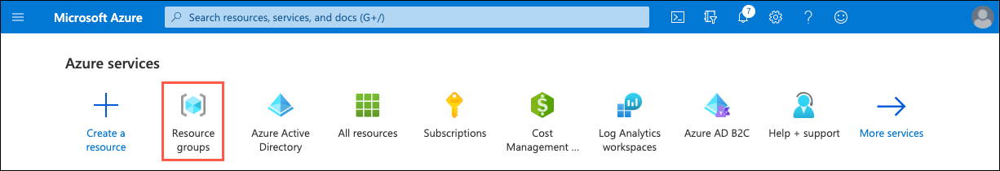

2. Select the **hands-on-lab-SUFFIX** resource group from the list.

   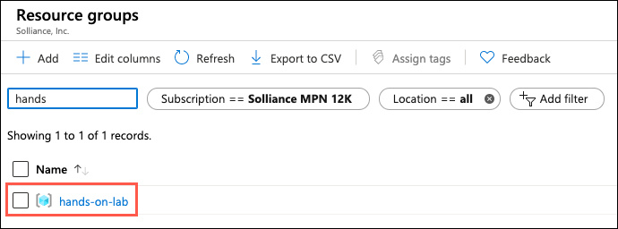

3. In the list of resources within your resource group, select the **ContosoSportsDB** SQL database resource.

   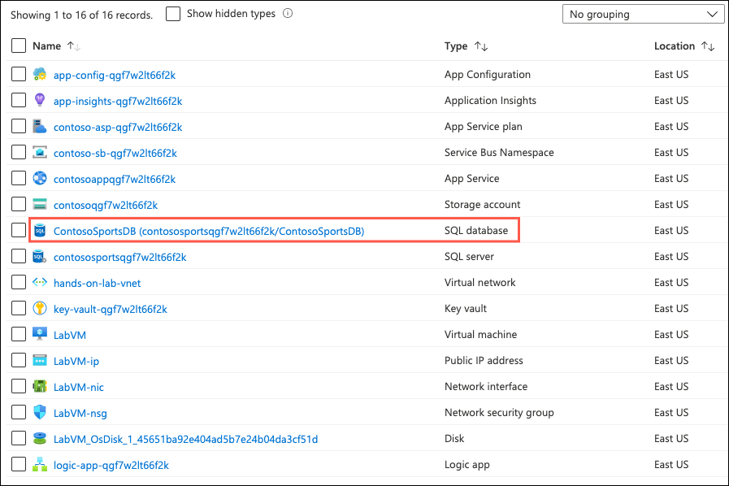

4. On the **SQL Database** blade, select the **Show database connection strings** link within the Essentials area.

    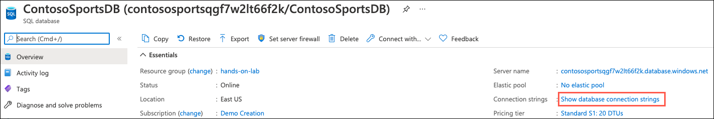

5. On the **Connection strings** blade, select the **Copy to clipboard** icon in the bottom right-hand corner of the `ADO.NET` connection string box.

    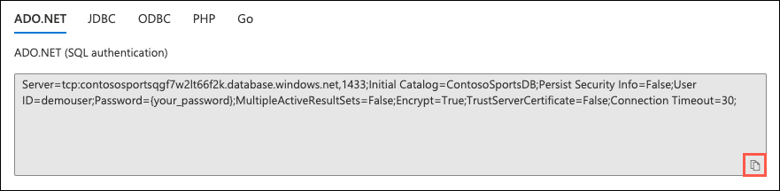

6. Paste the copied connection string into a text editor, such as **Notepad.exe** and then replace the `{your_password}` token with `Password.1!!`.

7. In the tasks below, you will be copying additional values into the text editor, so you can have easy access to these values for creating secrets in Key Vault later in this hand-on lab. Leave the text editor open.

## Task 2: Retrieve Storage Account access key

In this task, you retrieve the access key for your Azure Storage account and save it to a text editor, such as Notepad.exe.

1. Return to the **hands-on-lab-SUFFIX** resource group and select the **contoso** Storage account resource from the list.

    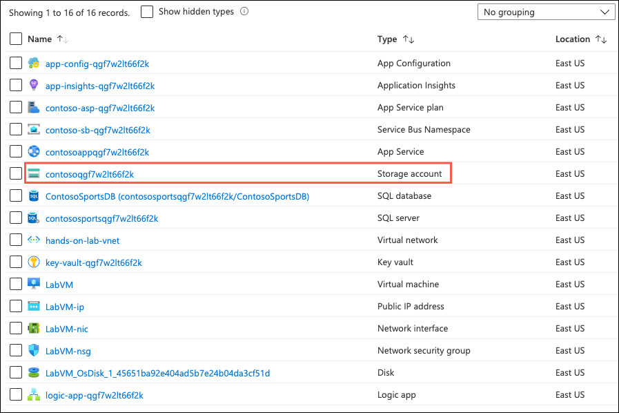

2. On the **Storage account** blade, select the **Access keys** in the left-hand navigation menu, and on the **Access keys** blade, from the top toolbar, select the **Show keys** button (text will change to **Hide keys**) and then copy the **key1** **Connection string** value by selecting the **Copy to clipboard** icon.

    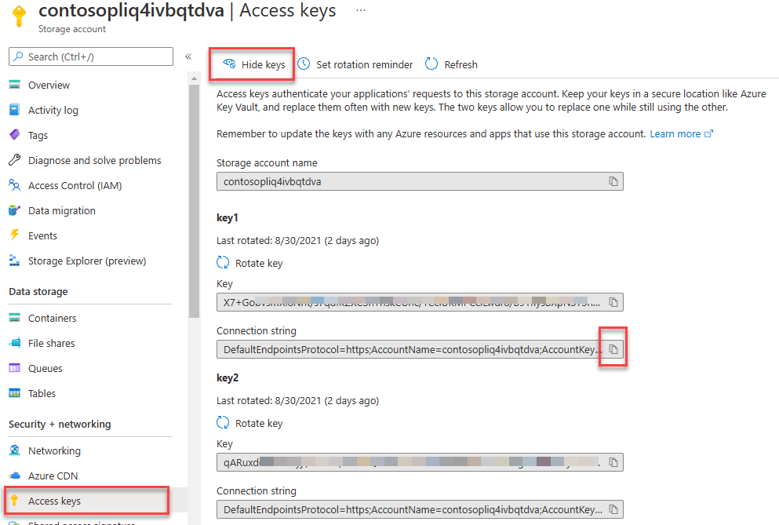

3. Paste the copied value into your open text editor for later reference, as you did with the database connection string above.

## Task 3: Retrieve Service Bus Queue connection string

In this task, you retrieve the primary connection string for the `receiptgenerator` Service Bus queue and save it to a text editor, such as Notepad.exe.

1. Return to the **hands-on-lab-SUFFIX** resource group and select the **Service Bus Namespace** resource from the list.

    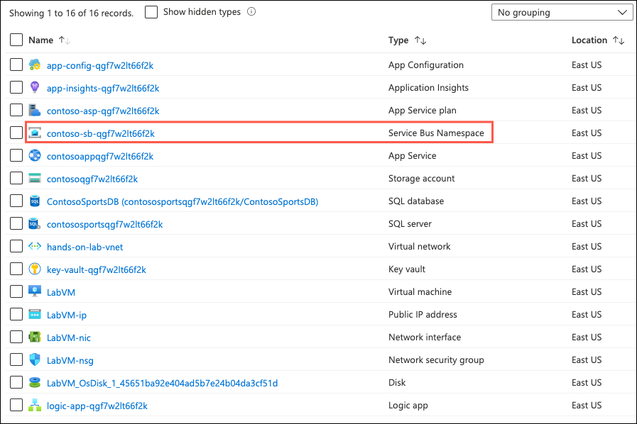

2. On the Service Bus Namespace blade, select **Queues** from the left-hand navigation menu, under the Entities header, and then select the `receiptgenerator` queue.

    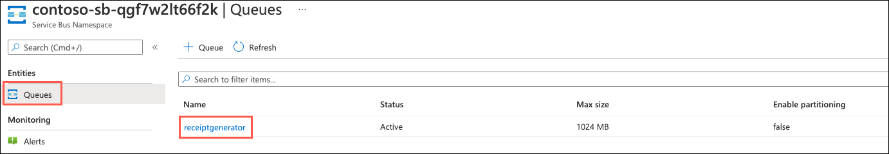

3. On the `receiptgenerator` Service Bus Queue blade, select **Shared access policies** in the left-hand navigation menu and then select the **Publisher** policy.

    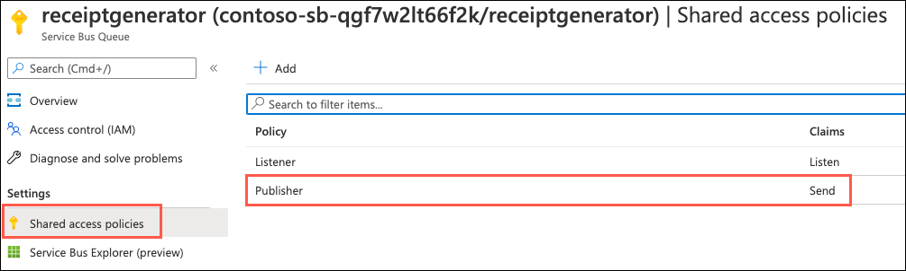

    >**Note**: The _Publisher_ and _Listener_ shared access policies for the Azure Service Bus Queue were deployed as part of the ARM Template that was used to setup the lab environment. Notice the **Publisher** policy only has permissions to _Send_ messages to the queue.
    >
    > By default, no policies are created. Additionally, it is best practice to use least privilege security to create separate shared access policies for publishers sending messages and listeners receiving messages from the queue.

4. On the **SAS Policy: Publisher** dialog, copy the **Primary Connection String** by selecting the **Copy to clipboard** icon.

    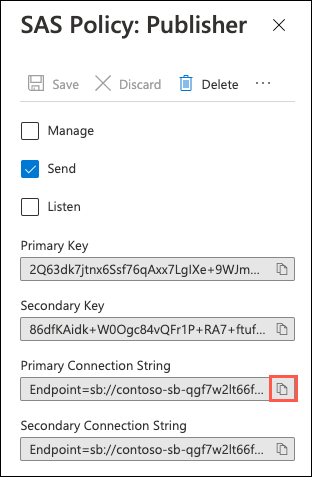

5. Paste the copied value into your open text editor for later reference, as you did with the database connection string above.

## Task 4: Create secrets in Azure Key Vault

In this task, you create secrets in Key Vault for each of the connection strings and keys you retrieved in the tasks above.

1. Return to the **hands-on-lab-SUFFIX** resource group and select the **Key vault** resource from the list.

    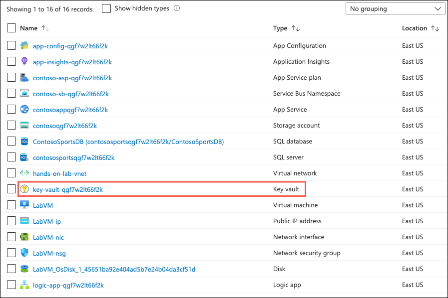

2. Select **Secrets** from the left-hand navigation menu and then select **Generate/Import**.

    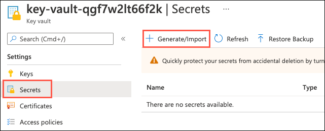

3. You will create three secrets in Key Vault, using the values you copied into your text editor. The secrets will be named according to the table below:

    | Name | Value |
    |------|-------|
    | AzureQueueConnectionString | Use the primary connection string you recorded for the Service Bus `receiptgenerator` queue |
    | ContosoSportsLeague | Use the database connection string |
    | contososportsstorage | Use the storage account connection string you recorded for the storage account |

4. On the **Create a secret** blade, enter the following:

    - **Name**: Enter `AzureQueueConnectionString`.
    - **Value**: Paste the Service Bus queue primary connection string value into this box.

    > The remaining settings will retain their default values.

    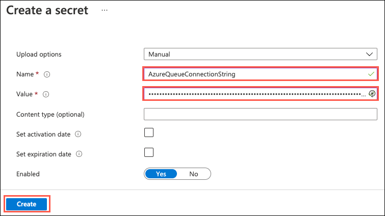

5. Select **Create**.

6. Select **Generate/Import** again and repeat steps 4 and 5 for the remaining two secrets specified in the table above, replacing the name and value settings with appropriate values.

7. You should end up with three secrets in Key Vault.

    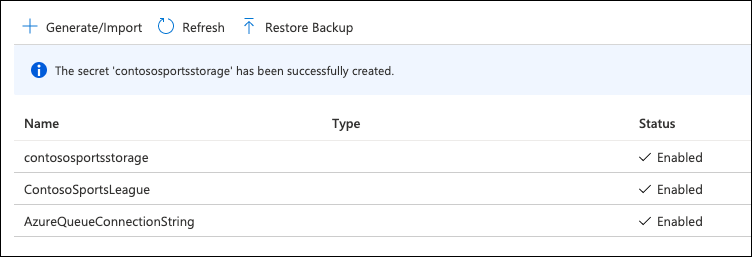

## Task 5: Centralize secrets for multiple projects using an App Configuration store

The Contoso Sports solution contains multiple projects, each of which access the same Azure resources. In this task, you centralize the configuration of the solution applications via the deployed Azure **App Configuration** resource.

1. Return to the **hands-on-lab-SUFFIX** resource group and select the **App Configuration** resource from the list.

    

2. Select **Configuration explorer** from the left-hand navigation menu and then select **Create** and **Key Vault reference**.

    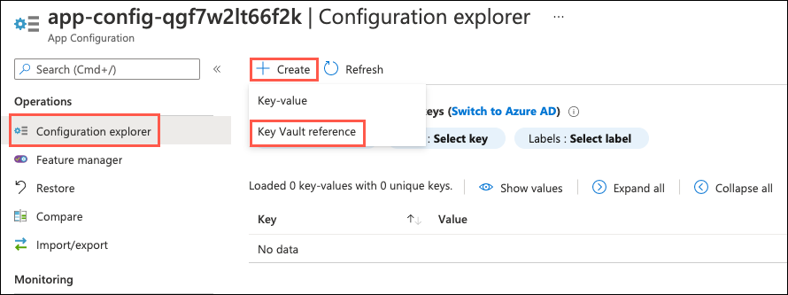

3. You will add a Key Vault reference for each of the three secrets you created in the previous task. The configuration values will be named according to the table below:

    | Key | Secret |
    |-----|--------|
    | ConnectionStrings:ReceiptQueue | Select **AzureQueueConnectionString** |
    | ConnectionStrings:ReceiptStorage | Select **contososportsstorage** |
    | ConnectionStrings:SportsDB | Select **ContosoSportsLeague** |

4. On the **Create** dialog, enter the following:

    - **Key**: Enter `ConnectionStrings:ReceiptQueue`.
    - **Subscription**: Select the subscription you are using for this hands-on lab.
    - **Resource group**: Select the **hands-on-lab-SUFFIX** resource group.
    - **Key Vault**: Choose the **key-vault-UNIQUE-ID** Key Vault resource.
    - **Secret**: Select the secret named `AzureQueueConnectionString`.

    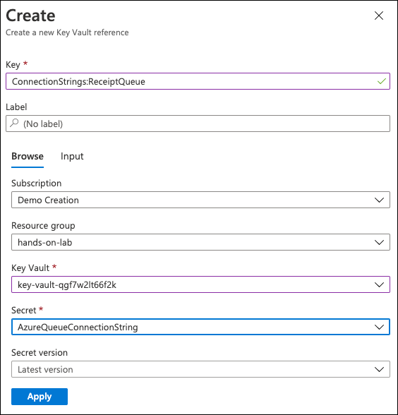

5. Select **Apply** on the Create dialog.

6. Select **Create --> Key Vault reference** again and repeat steps 4 and 5 for the remaining two keys specified in the table above, populating the **Key** and **Secret** fields with appropriate values.

7. From the left menu, select **Access keys** within the Settings section, copy the **Primary key Connection string** value using the clipboard icon. Save this value for a future task.

    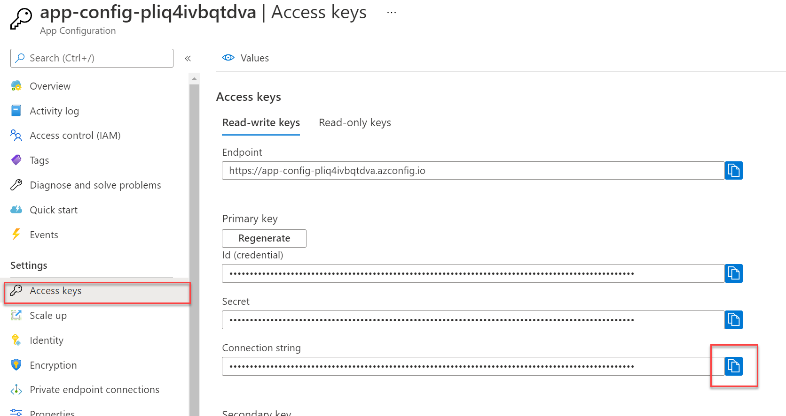
