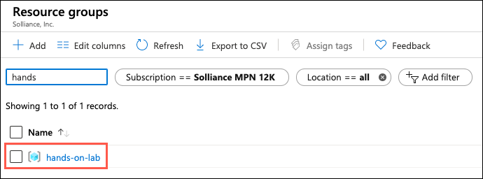
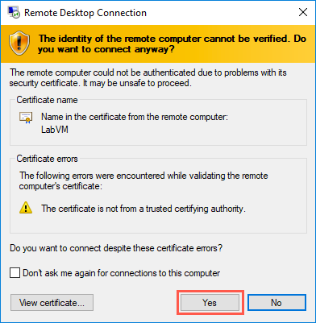
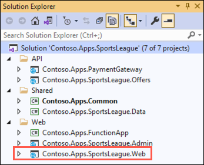

# Challenge 2: Deploy e-commerce website

**Duration**: 15 minutes

In this challenge, you deploy the Contoso web app and provide the necessary configuration to display the e-commerce website.

- [Challenge 2: Deploy e-commerce website](#challenge-2-deploy-e-commerce-website)
  - [Task 1: Configure SQL Database firewall](#task-1-configure-sql-database-firewall)
  - [Task 2: Connect to the Lab VM](#task-2-connect-to-the-lab-vm)
  - [Task 3: Open the Contoso Sports League starter solution in Visual Studio](#task-3-open-the-contoso-sports-league-starter-solution-in-visual-studio)
  - [Task 4: Configure the e-commerce Web App in Visual Studio](#task-4-configure-the-e-commerce-web-app-in-visual-studio)
  - [Task 5: Publish the web app to Azure](#task-5-publish-the-web-app-to-azure)

## Task 1: Configure SQL Database firewall

In this task, you set up access to the Azure SQL Database from your local machine.

1. In the [Azure portal](https://portal.azure.com), select **Resource groups** from the Azure services list.

   

2. Select the **hands-on-lab-SUFFIX** resource group from the list.

   

3. In the list of resources within your resource group, select the **contososports** SQL Server resource.

   

4. On the **Overview** blade for the **SQL Server** resource, select the **Show firewall settings** in the Essentials area.

    

5. On the **Firewalls and virtual networks** blade, select **Add client IP** from the toolbar.

    

6. A new rule will be generated that contains your client IP address for the **Start IP** and **End IP**. This allows you to connect to the database from your machine.

    

7. Select **Save** on the toolbar.

    

8. Select **OK** on the **Success** dialog when it appears.

    

## Task 2: Connect to the Lab VM

In this task, you create an RDP connection to your Lab virtual machine (VM).

1. In the [Azure portal](https://portal.azure.com), select **Resource groups** from the Azure services list.

   

2. Select the **hands-on-lab-SUFFIX** resource group from the list.

   

3. In the list of resources within your resource group, select the **LabVM Virtual machine** resource.

   

4. On your LabVM blade, select **Connect** and **RDP** from the top menu.

   

5. On the Connect to virtual machine blade, select **Download RDP File**, then open the downloaded RDP file.

   

6. Select **Connect** on the Remote Desktop Connection dialog.

   

7. Enter the following credentials when prompted and select **OK**:

   - **User name**: demouser
   - **Password**: Password.1!!

   

8. Select **Yes** to connect if prompted that the remote computer's identity cannot be verified.

   

## Task 3: Open the Contoso Sports League starter solution in Visual Studio

1. On the LabVM, open File Explorer and navigate to the `C:\MCW\MCW-Modern-cloud-apps-main\Hands-on lab\lab-files\src\Contoso Sports League` folder.

2. From the **Contoso Sports League** folder, open the Visual Studio solution by double-clicking on the `Contoso.Apps.SportsLeague.sln` file.

3. If prompted about how to open the file, select **Visual Studio 2019**, and then select **OK**.

   

4. Sign in to Visual Studio using your Azure account credentials.

   

5. If prompted with a security warning, uncheck **Ask me for every project in this solution**, and then select **OK**.

6. Using the Visual Studio Solution Explorer, expand each of the folders and notice the solution contains the following projects:

    | Project | Description |
    |:----------|:-------------|
    | Contoso.Apps.SportsLeague.Web |   Contoso Sports League e-commerce application |
    | Contoso.Apps.SportsLeague.Admin |   Contoso Sports League call center admin application |
    | Contoso.Apps.Common  |   Shared tier |
    | Contoso.Apps.SportsLeague.Data  |   Shared tier |
    | Contoso.Apps.FunctionApp  |   Function app tier |
    | Contoso.Apps.SportsLeague.Offers |  API for returning list of available products |
    | Contoso.Apps.PaymentGateway   |     API for payment processing |

   

## Task 4: Configure the e-commerce Web App in Visual Studio

1. Navigate to the `Contoso.Apps.SportsLeague.Web` project located in the **Web** folder using the **Solution Explorer** of Visual Studio.

    

2. Right-click the `Contoso.Apps.SportsLeague.Web` project and select **Manage NuGet Packages** from the context menu.

3. Select the **Browse** tab and search for **Microsoft.Azure.AppConfiguration.AspNetCore**.

4. Select **Microsoft.Azure.AppConfiguration.AspNetCore** from the search results, and in the next pane, select **Install** to install the latest stable version.

    

5. Repeat step 4-6, this time installing the latest **Azure.Identity**.

6. Now you are ready to configure this application to use the App Configuration in Azure. Expand the **Contoso.Apps.SportsLeague.Web** project and open the `Program.cs` file.

7. Uncomment the following **using** statements at the top of the file:

    ```csharp
    using Microsoft.Extensions.Configuration;
    using Azure.Identity;
    ```

8. In the **CreateHostBuilder** method, uncomment the following code. This tells the application to utilize the AppConfig connection string that you've already setup on the **contosoapp** application service to point to the centralized App Configuration resource.

    ```csharp
    webBuilder.ConfigureAppConfiguration((hostingContext, config) =>
    {
        var settings = config.Build();

        config.AddAzureAppConfiguration(options =>
        {
            options.Connect(settings["ConnectionStrings:AppConfig"])
                    .ConfigureKeyVault(kv =>
                    {
                        kv.SetCredential(new DefaultAzureCredential());
                    });
        });
    })
    .UseStartup<Startup>();
    ```

9. Save `Program.cs` by selecting Save on the Visual Studio toolbar.

## Task 5: Publish the web app to Azure

1. Right-click the **Contoso.Apps.SportsLeague.Web** project in the Visual Studio Solution Explorer and select **Publish**.

    

2. On the Publish dialog, select **Azure** as the **Target**, then select **Next**.

    

3. For **Specific target**, select **Azure App Service (Windows)**, then select **Next**.

    

4. On the **App Service** tab of the Publish dialog, select the appropriate subscription, then expand the **hands-on-lab-SUFFIX** resource group, select the **contosoapp** Web App from the list, and then select **Finish**.

    

5. Back in Visual Studio, select **Publish** to publish the Web application.

    

6. In the Visual Studio **Output** view, you will see a status that indicates the Web App was published successfully.

    

    >**Note**: Your URL will differ from the one shown in the Output screenshot because it must be globally unique.

7. A new browser should automatically open the deployed web application. Validate the website by choosing the **Store** link on the menu. You should see product items. If products are returned, then the connection to the database was successful.

    

    >**Troubleshooting**: If the web site fails to start up or show products, go back and double check all your connection string entries and passwords web application settings. If you get a message indicating the Service is unavailable. Give it a moment and refresh your browser.
