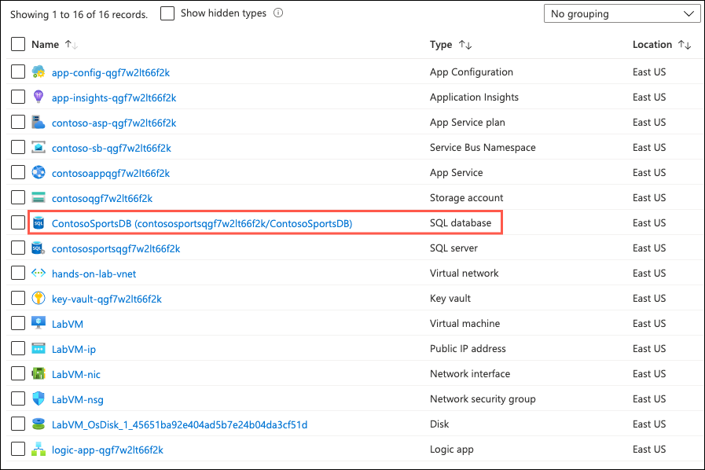
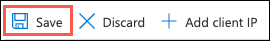
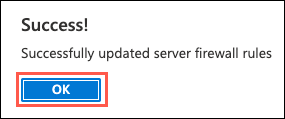
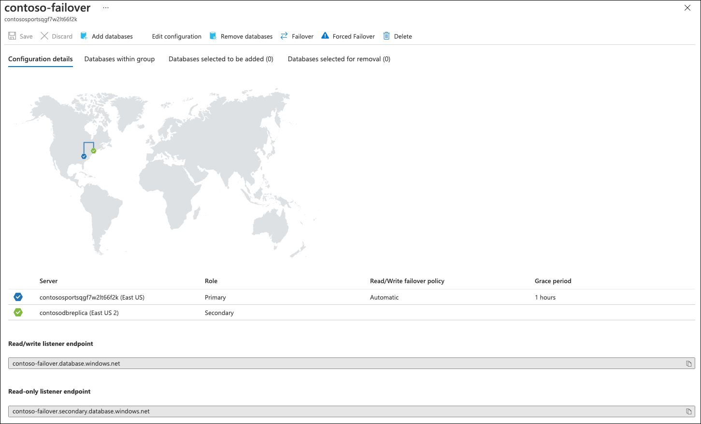
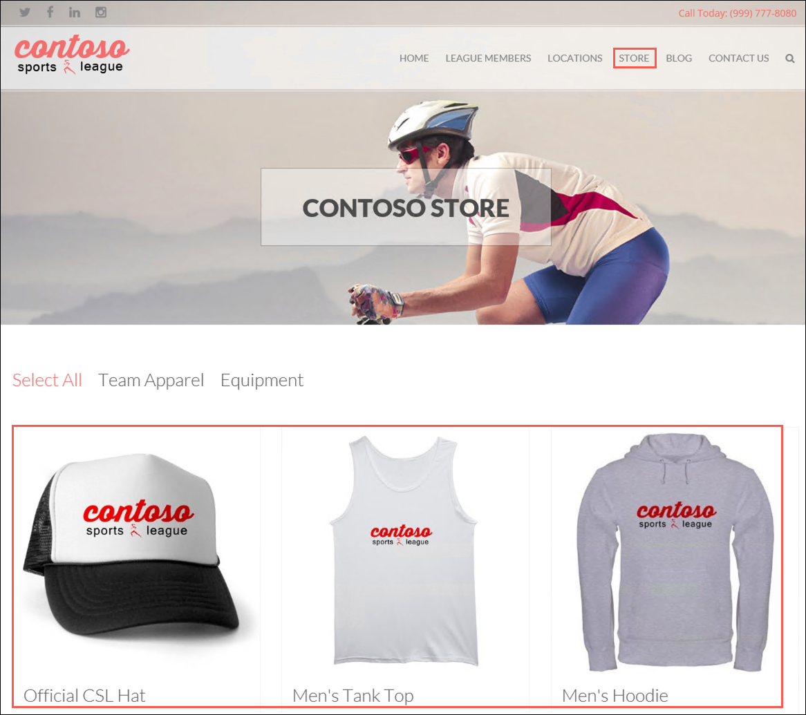

# Challenge 3: Setup SQL Database Geo-Replication

**Duration**: 45 minutes (15 minutes if not performing optional failover)

In this challenge, the attendee will provision a secondary SQL Database and configure Geo-Replication using the Microsoft Azure Portal.

- [Challenge 3: Setup SQL Database Geo-Replication](#challenge-3-setup-sql-database-geo-replication)
  - [Task 1: Add secondary database](#task-1-add-secondary-database)
  - [Task 2: Configure secondary SQL Database firewall](#task-2-configure-secondary-sql-database-firewall)
  - [Task 3: Setup SQL Failover Group](#task-3-setup-sql-failover-group)
  - [Task 4: Update database connection string to use failover listener endpoint](#task-4-update-database-connection-string-to-use-failover-listener-endpoint)
  - [Task 5: Failover SQL Database Failover Group](#task-5-failover-sql-database-failover-group)
  - [Task 6: Test e-commerce Web App after Failover](#task-6-test-e-commerce-web-app-after-failover)

## Task 1: Add secondary database

1. In the [Azure portal](https://portal.azure.com), select **Resource groups** from the Azure services list.

   

2. Select the **hands-on-lab-SUFFIX** resource group from the list.

   

3. In the list of resources within your resource group, select the **ContosoSportsDB** SQL database resource.

   

4. Select **Replicas** in the left-hand navigation menu, under **Data management**.

    

5. On the Replicas blade, select **Create replica** from the toolbar menu.

    

6. On the **Create SQL Database - Geo Replica** Basics tab, select **Create new** for the **Server** and in the **Create SQL Database Server** form, enter the following values:

    - **Server name**: Enter a globally unique value, such as `contosodbreplicaSUFFIX`, where `SUFFIX` is a unique identifier (ensure the green checkmark appears).
    - **Location**: Select a region for your secondary region, for additional guidance, see the **Important** note below.
    - Check **Allow Azure services to access server**.
    - **Server admin login**: Enter `demouser`.
    - **Password**: Enter `Password.1!!`.
    - **Confirm password**: Enter `Password.1!!`.

    

       > **Important**: The secondary Azure Region should be the Region Pair for the region the SQL Database is hosted in. Consult <https://docs.microsoft.com/azure/best-practices-availability-paired-regions> to see which region pair the location you are using for this lab is in.

    >**Note**: If you choose a region that cannot be used as a secondary region, you will receive a validation error.

7. Select **OK**.

8. Returning to the main form, leave SQL elastic pool set to **No** and the Compute + Storage set to **Standard S1**. Select **Geo-redundant backup storage** for the **Backup storage redundancy**, and then select **Next: Networking**.

    

9. On the **Networking** tab, set **Allow Azure services and resources to access this server** to **Yes**.

    

10. Select **Review + create** and on the Review + create tab, select **Create** to start the deployment of the secondary database.

    > **Note**: Deployment of the secondary database for geo-replication takes several minutes to complete.

## Task 2: Configure secondary SQL Database firewall

In this task, you set up access to the secondary Azure SQL Database from your local machine.

1. After the Geo-Replication has finished provisioning, select **Go to resource** from the deployment blade.

    

2. In the Essentials area of the SQL database, select the **Server name** link to navigate to the SQL Server hosting the database.

    

3. On the **Overview** blade for the **SQL Server** resource, select the **Show firewall settings** in the Essentials area.

    

4. On the **Firewalls and virtual networks** blade, select **Add client IP** from the toolbar.

    

5. A new rule will be generated that contains your client IP address for the **Start IP** and **End IP**. This allows you to connect to the database from your machine.

    

6. Select **Save** on the toolbar.

    

7. Select **OK** on the **Success** dialog when it appears.

    

## Task 3: Setup SQL Failover Group

With SQL Database Geo-Replication configured, the Azure SQL Failover Groups feature can be used to enable "auto failover" scenarios for the SQL Database. This enables a single connection string endpoint to be used by the application, and SQL Database will automatically handle failing over from Primary to Secondary database in the event of a SQL Database outage / down time.

1. Return to the **hands-on-lab-SUFFIX** resource group and select the **contososports** SQL Server resource associated with the primary database.

   

2. On the **SQL server** blade, select **Failover groups** under **Data management** in the left-hand navigation menu.

    

3. On the **Failover groups** pane, select **Add group** on the toolbar.

    

4. On the **Failover group** pane, enter the following:

    - **Failover group name**: Enter a globally unique name, such as `contoso-failover-SUFFIX`.
    - **Server**: Select the secondary server you created above.
    - **Read/Write failover policy**: Choose **Automatic**.
    - **Read/Write grace period (hours)**: Choose **1 hours**.
    - **Database within group**: Select **Configure database**, check the box next to the **ContosoSportsDB** database on the replica, and then select **Select**.

    

    

    

5. Select **Create** to create the SQL Failover Group.

6. Once the Failover Group has been created, select it in the list. You may need to select **Refresh** from the toolbar menu to see the group.

    

7. On the **Failover group** pane, you will see a map displaying the locations of the _Primary_ and _Secondary_ SQL Database servers within the failover group. Below that, the _Primary_ database shows as **Automatic** failover for Read/Write of data, while the _Secondary_ database does not since it is currently Read only.

    

8. Below the map you will find the **Read/write listener endpoint** and the **Read-only listener endpoint**. These allow for applications to be configured to connect to the SQL Failover Group endpoints instead of the individual SQL Server endpoints. Copy both **Listener Endpoint** values and paste into a text editor, such as Notepad.exe, for later reference.

    

## Task 4: Update database connection string to use failover listener endpoint

In this task, you update the database connection string in Key Vault to use the read/write listener endpoint of the failover group.

1. Return to the **hands-on-lab-SUFFIX** resource group and select the **Key vault** resource from the list.

    

2. Select **Secrets** from the left-hand navigation menu and then select the **ContosoSportsLeague** secret.

    

3. On the ContosoSportsLeague **Versions** blade, select **New Version** on the toolbar.

    

4. Copy the original connection string to the **ContosoSportsDB**, but replace the server name with the **Azure SQL Failover Group Read/Write Listener Endpoint** that was copied previously, then select **Create**. The new version of the connection string should look similar to the following:

    ```sh
    Server=tcp:{failover_group_endpoint},1433;Initial Catalog=ContosoSportsDB;Persist Security Info=False;User ID=demouser;Password=Password.1!!;MultipleActiveResultSets=False;Encrypt=True;TrustServerCertificate=False;Connection Timeout=30;
    ```

    

## Task 5: Failover SQL Database Failover Group

> **THIS TASK IS OPTIONAL**: The replication and failover process can take anywhere from 10 to 30 minutes to complete, so you have the option to skip tasks 5 and 6, and go directly to challenge 4. However, if you have the time, it is recommended that you complete these steps.

1. Return to the **hands-on-lab-SUFFIX** resource group and select the **contososports** SQL Server resource associated with the primary database.

   

2. On the **SQL server** blade, select **Failover groups** under **Data management** in the left-hand navigation menu.

    

3. Select your failover group in the list.

    

4. On the Failover group blade, select the **Forced Failover** button on the toolbar, then select **Yes** to confirm the forced failover of the SQL Database Failover Group.

    

> **Note**: The failover may take a few minutes to complete. You can continue with the next challenge and return later to complete the next task.

## Task 6: Test e-commerce Web App after Failover

1. Return to the **hands-on-lab-SUFFIX** resource group and select the **contosoapp** App Service resource.

   

2. On the **App Service** blade, select the **URL** of the Web App displayed in the Essentials area to open it in a new browser tab.

    

3. In the e-commerce Web App, select **STORE** in the top navigation bar of the website and verify the product list from the database displays.

    
