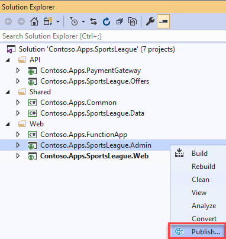

# Challenge 4: Deploy the Call Center admin website

**Duration**: 15 minutes

In this challenge, you provision a website via the Azure Web App template using the [Azure portal](https://portal.azure.com/). You then edit the necessary configuration files in the Starter Project and deploy the call center admin website.

- [Challenge 4: Deploy the Call Center admin website](#challenge-4-deploy-the-call-center-admin-website)
  - [Task 1: Provision a Web App](#task-1-provision-a-web-app)
  - [Task 2: Update the configuration in the starter project](#task-2-update-the-configuration-in-the-starter-project)
  - [Task 3: Add a managed identity and set a Key Vault access policy](#task-3-add-a-managed-identity-and-set-a-key-vault-access-policy)
  - [Task 4: Configure and deploy the call center admin Web App from Visual Studio](#task-4-configure-and-deploy-the-call-center-admin-web-app-from-visual-studio)

## Task 1: Provision a Web App

1. In the [Azure portal](https://portal.azure.com), select **Resource groups** from the Azure services list.

   

2. Select the **hands-on-lab-SUFFIX** resource group from the list.

   

3. On the Resource group blade, select **Add** on the toolbar.

    

4. On the create a resource blade, enter "Web App" into the search box and select **Web App** in the search results and then select **Create**.

    

5. On the Create Web App **Basics** tab, enter the following:

    **Project Details**:

    - **Subscription**: Select the subscription you are using for this hands-on lab.
    - **Resource group**: Select the **hands-on-lab-SUFFIX** resource group.

    **Instance Details**:

    - **Name**: Enter a **unique Name** for the Web App, such as `contosoadminSUFFIX`.
    - **Publish**: Select **Code**.
    - **Runtime stack**: Choose **.NET Core 3.1 (LTS)**.
    - **Operating System**: Choose **Linux**.
    - **Region**: Select a different region than the one you are using for the hands-on-lab-SUFFIX resource group and other resources in this hands-on lab, as you cannot mix Linux and Windows app services in the same region in the same resource group. For example, if you are using **East US**, select **East US 2** for the region.

    **App Service Plan**:

    - **Linux Plan**: Accept the default new plan name.
    - **Sku and size**: Accept the default **Premium V2 P1v2** plan.

    

6. Select **Review and create**, then **Create** to provision the web app.

## Task 2: Update the configuration in the starter project

1. Navigate to the **App Service** blade for the Call Center Admin App just provisioned.

2. On the **App Service** blade, select **Configuration** in the left-hand navigation menu.

    

3. Scroll down and locate the **Connection strings** section.

4. Add a new **Connection String** with the following values, and select **OK**:

   - **Name**: Enter `AppConfig`.
   - **Value**: Enter the Connection String for the App Configuration Store. You copied this into your text editor previously. Otherwise, you can retrieve it from the Access Keys blade of the App Configuration resource.
   - **Type**: Select **Custom**.

    

5. Select the **OK** button.

6. Select the **Save** button. Select **Continue** if prompted to verify your action.

    

## Task 3: Add a managed identity and set a Key Vault access policy

The call center web application resource needs access to the Key Vault. The App Configuration will use pass-through authentication to the Key Vault. To authenticate the application, it will utilize a system managed identity.

1. From the left-hand navigation menu, select **Identity**, and on the Identity blade, change the status to **On** and select **Save** on the toolbar. Select **Yes** if prompted to verify your action.

    

2. Return to the **hands-on-lab-SUFFIX** resource group and select the **Key vault** resource from the list.

    

3. From the left menu, select **Access policies** and then select the **Add Access Policy** link.

    

4. In the **Add access policy** form:

    - **Secret permissions**: Expand the list and check the box next to **Get**.
    - **Select principal**: Select **None selected** and in the **Select principal** dialog, search for the name of the call center application you just created and choose the managed identity.

    

5. Select **Add** on the Add access policy dialog.

6. Select **Save** on the Access policies toolbar to commit the changes.

## Task 4: Configure and deploy the call center admin Web App from Visual Studio

1. Return to Visual Studio on the LabVM and navigate to the **Contoso.Apps.SportsLeague.Admin** project located in the **Web** folder using the **Solution Explorer**.

2. Right-click the **Contoso.Apps.SportsLeague.Admin** project and select **Manage NuGet Packages**.

3. Select the **Browse** tab, and search for **Microsoft.Azure.AppConfiguration.AspNetCore**.

4. Select **Microsoft.Azure.AppConfiguration.AspNetCore** from the search results, and in the next pane, select **Install** to install the latest stable version.

    

5. Repeat step 4-6, this time installing the latest **Azure.Identity**.

6. Now we are ready to configure this application to use the App Configuration in Azure. Under the `Contoso.Apps.SportsLeague.Admin` project, open the `Program.cs` file.

7. Uncomment the following **using** statements at the top of the file:

    ```csharp
    using Microsoft.Extensions.Configuration;
    using Azure.Identity;
    ```

8. In the **CreateHostBuilder** method, uncomment the following code - this tells the application to utilize the AppConfig connection string that you've already setup on the **contosoapp** application service to point to the centralized App Configuration resource. Once complete, save the file.

    ```csharp
    webBuilder.ConfigureAppConfiguration((hostingContext, config) =>
    {
        var settings = config.Build();

        config.AddAzureAppConfiguration(options =>
        {
            options.Connect(settings["ConnectionStrings:AppConfig"])
                    .ConfigureKeyVault(kv =>
                    {
                        kv.SetCredential(new DefaultAzureCredential());
                    });
        });
    })
    .UseStartup<Startup>();
    ```

9. Right-click the `Contoso.Apps.SportsLeague.Admin` project and select **Publish**.

    

10. On the Publish dialog, select **Azure** for the **Target**, then select **Next**.

11. For **Specific target**, select **Azure App Service (Linux)**, then select **Next**.

12. For **App Service**, expand the lab Resource group, and select the **Web App** that was created for the Call Center Admin Web App (with the name that was created previously).

    

13. Select **Finish**.

14. Select **Publish** to publish the Web application.

    

15. Once deployment is complete, the Web App should open in a browser. It should look like the following:

    

    > **Note**: If you see a page that indicates the app service is running and asking about deploying code, refresh the browser window by selecting CTRL+F5.
