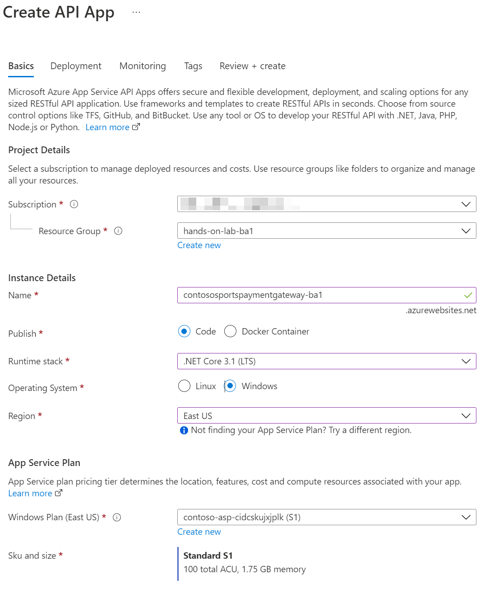
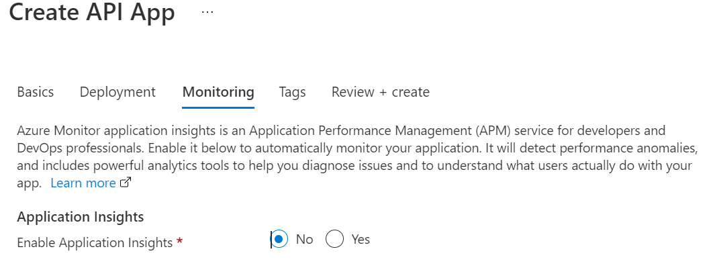
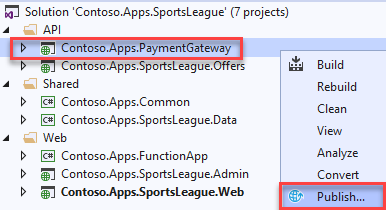
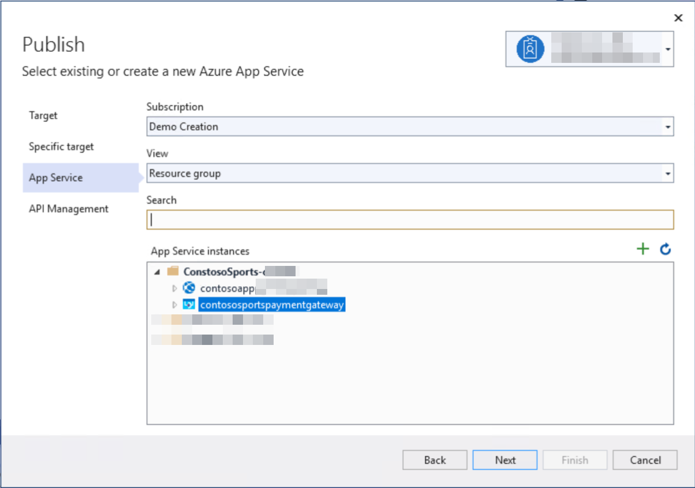
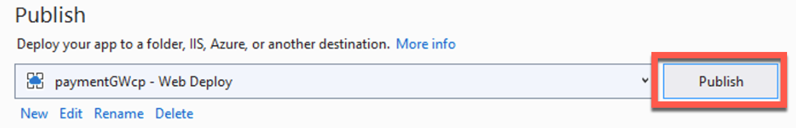
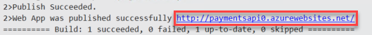
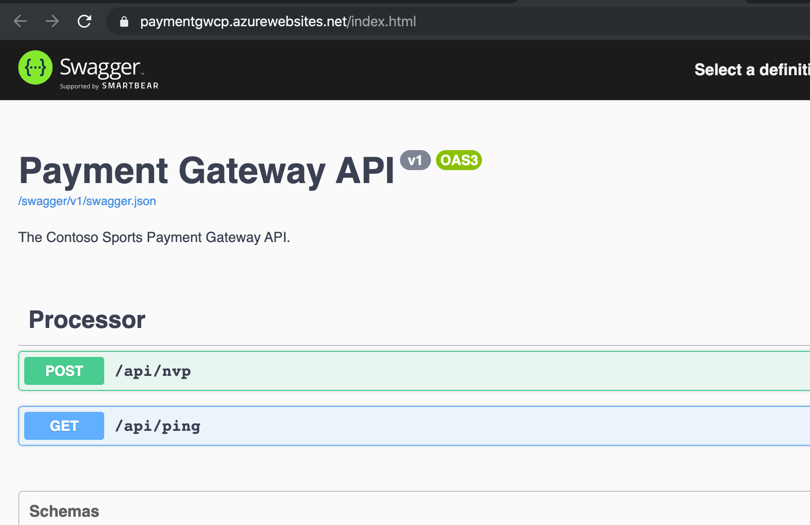

# Challenge 5: Deploy the payment gateway

**Duration**: 10 minutes

In this challenge, the attendee will provision an Azure API app template using the Microsoft Azure Portal. The attendee will then deploy the payment gateway API to the API app.

- [Challenge 5: Deploy the payment gateway](#challenge-5-deploy-the-payment-gateway)
  - [Task 1: Provision the payment gateway API App](#task-1-provision-the-payment-gateway-api-app)
  - [Task 2: Deploy the Payment Gateway from Visual Studio](#task-2-deploy-the-payment-gateway-from-visual-studio)

## Task 1: Provision the payment gateway API App

1. In the [Azure portal](https://portal.azure.com), select **Resource groups** from the Azure services list.

   

2. Select the **hands-on-lab-SUFFIX** resource group from the list.

   

3. On the Resource group blade, select **Create** on the toolbar.

    

4. On the create a resource blade, enter "API App" into the search box and select **API App** in the search results and then select **Create**.

5. On the new **Create API App** Basics tab, populate the form with the following values:

   - **Subscription:** Your Azure subscription.
   - **Resource Group:** Select the lab resource group
   - **Name:** Specify a unique name for the App Name, like **contososportspaymentgateway{{SUFFIX}}**.
   - **Publish:** Select **Code**.
   - **Runtime stack:** Select **.NET Core 3.1 (LTS)**.
   - **Operating System:** Select **Windows**.
   - **Region:** Select the lab region.
   - **App Service Plan:** Select the **contoso-asp-UNIQUEID** plan.
   - **Sku and size:** Retain the default value.

    

6. Select the **Monitoring** tab.

7. In the **Enable Application Insights** field, select **No**.

    

8. Select **Review + create**, then **Create**.

9. Wait until the deployment completes to move on to the next task.

## Task 2: Deploy the Payment Gateway from Visual Studio

1. In Visual Studio, navigate to the **Contoso.Apps.PaymentGateway** project located in the **APIs** folder using the **Solution Explorer**.

2. Right-click the **Contoso.Apps.PaymentGateway** project and select **Publish**.

    

3. On the Publish dialog, select **Azure** as the **Target**, then select **Next**.

4. For **Specific target**, select **Azure App Service (Windows)**, then select **Next**.

5. For **App Service**, expand the resource group, and select the API app service that you created for the payment gateway from the list, then choose **Next**.

    

6. In the **API Management** form, check the **Skip this step** checkbox. Select **Finish**.

7. Select **Publish** to publish the API App.

    

8. In the Visual Studio **Output** view, you will see a status indicating the Web App was published successfully. Copy and paste the gateway **URL** of the deployed **API App** from the Visual Studio **Output** into Notepad for later use.

    

9. Viewing the Web App in a browser will display the Swagger UI for the API.

   

  > **Note**: When opening the Swagger UI using the Internet Explorer browser you will see a "Resolver error" error message. This is a result of the Swagger UI no longer supporting Internet Explorer. Copy the URL and try opening the page in Microsoft Edge, which has been installed on the LabVM. The Swagger UI will work as expected.
