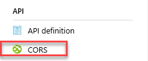
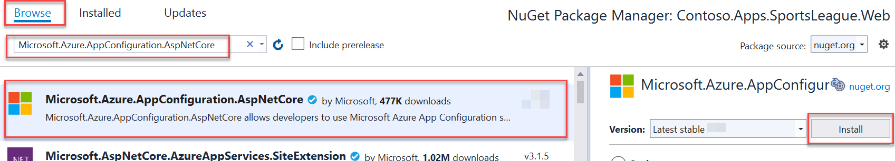
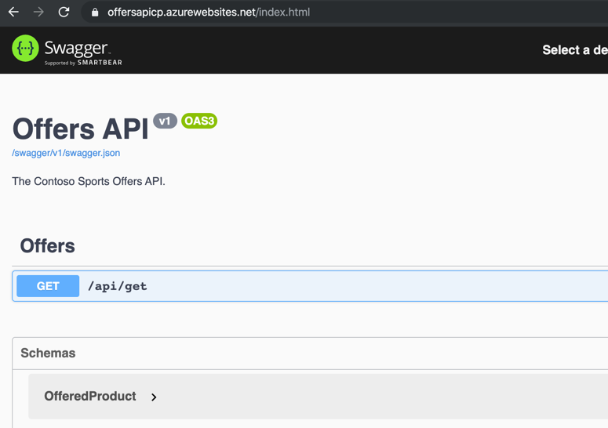

# Challenge 6: Deploy the Offers Web API

**Duration**: 10 minutes

In this challenge, the attendee will provision an Azure API app template using the Microsoft Azure Portal. The attendee will then deploy the Offers Web API.

- [Challenge 6: Deploy the Offers Web API](#challenge-6-deploy-the-offers-web-api)
  - [Task 1: Provision the Offers Web API App](#task-1-provision-the-offers-web-api-app)
  - [Task 2: Configure Cross-Origin Resource Sharing (CORS)](#task-2-configure-cross-origin-resource-sharing-cors)
  - [Task 3: Update the configuration in the starter project](#task-3-update-the-configuration-in-the-starter-project)
  - [Task 4: Add a managed identity and set a Key Vault access policy](#task-4-add-a-managed-identity-and-set-a-key-vault-access-policy)
  - [Task 5: Deploy the Offers app from Visual Studio](#task-5-deploy-the-offers-app-from-visual-studio)

## Task 1: Provision the Offers Web API App

1. In the [Azure portal](https://portal.azure.com), select **Resource groups** from the Azure services list.

   

2. Select the **hands-on-lab-SUFFIX** resource group from the list.

   

3. On the Resource group blade, select **Create** on the toolbar.

    

4. On the new **Create API App** Basics tab, populate the form with the following values:

   - **Subscription:** Your Azure subscription.
   - **Resource Group:** Select the lab resource group
   - **Name:** Specify a unique name for the App Name, such as **contoso-offers-api-{{SUFFIX}}**.
   - **Publish:** Select **Code**.
   - **Runtime stack:** Select **.NET Core 3.1 (LTS)**.
   - **Operating System:** Select **Windows**.
   - **Region:** Select the lab region.
   - **App Service Plan:** Select the **contoso-asp-UNIQUEID** plan.
   - **Sku and size:** Retain the default value.

    

5. Select the **Monitoring** tab.

6. In the **Enable Application Insights** field, select **No**.

    

7. Select **Review + create**, then **Create**.

8. When the API App has completed provisioning, return to the resource group, then select the new API App from the list of resources.

## Task 2: Configure Cross-Origin Resource Sharing (CORS)

1. On the **App Service** blade for the Offers API, under the **API** menu section, scroll down and select **CORS**.

    

2. In the **Allowed Origins** text box, specify `*` to allow all origins, and select **Save**.

    >**Note**: You should not normally do this in a production environment. In production, you should enter the specific domains as allowed origins you need to allow CORS access to the API. The wildcard (*) is used for this lab to make it easier just for this lab.

    

## Task 3: Update the configuration in the starter project

1. On the **App Service** blade for the Offers API, select **Configuration**.

    

2. Scroll down and locate the **Connection strings** section.

3. Add a new **Connection String** with the following values, and select **OK**:

   - **Name**: Enter `AppConfig`.
   - **Value**: Enter the Connection String for the App Configuration Store. You copied this into your text editor previously. Otherwise, you can retrieve it from the Access Keys blade of the App Configuration resource.
   - **Type**: Select **Custom**.

    

4. Select the **OK** button.

5. Select the **Save** button.

    

## Task 4: Add a managed identity and set a Key Vault access policy

The offers api resource needs access to the Key Vault. The App Configuration will use pass-through authentication to the Key Vault. To authenticate the application, it will utilize a system managed identity.

1. From the left-hand navigation menu, select **Identity**, and on the Identity blade, change the status to **On** and select **Save** on the toolbar.

    

2. Return to the **hands-on-lab-SUFFIX** resource group and select the **Key vault** resource from the list.

    

3. From the left menu, select **Access policies** and then select the **Add Access Policy** link.

    

4. In the **Add access policy** form:

    - **Secret permissions**: Expand the list and check the box next to **Get**.
    - **Select principal**: Select **None selected** and in the **Select principal** dialog, search for the name of the call center application you just created and choose the managed identity.

    

5. Select **Add** on the Add access policy dialog.

6. Select **Save** on the Access policies toolbar to commit the changes.

## Task 5: Deploy the Offers app from Visual Studio

1. Navigate to the **Contoso.Apps.SportsLeague.Offers** project located in the **APIs** folder using the **Solution Explorer** in Visual Studio.

2. Right-click the **Contoso.Apps.SportsLeague.Offers** project and select **Manage NuGet Packages**.

3. Select the **Browse** tab, and search for **Microsoft.Azure.AppConfiguration.AspNetCore**.

4. Select **Microsoft.Azure.AppConfiguration.AspNetCore** from the search results, and in the next pane, select **Install** to install the latest stable version.

    

5. Repeat step 4-6, this time installing the latest **Azure.Identity**.

6. Now we are ready to configure this application to use the App Configuration in Azure. Under the **Contoso.Apps.SportsLeague.Offers** project, open the `Program.cs` file.

7. Uncomment the following **using** statements at the top of the file:

    ```csharp
    using Microsoft.Extensions.Configuration;
    using Azure.Identity;
    ```

8. In the **CreateHostBuilder** method, uncomment the following code - this tells the application to utilize the AppConfig connection string that you've already setup on the API application service to point to the centralized App Configuration resource. Once complete, save the file.

    ```csharp
    webBuilder.ConfigureAppConfiguration((hostingContext, config) =>
    {
        var settings = config.Build();

        config.AddAzureAppConfiguration(options =>
        {
            options.Connect(settings["ConnectionStrings:AppConfig"])
                    .ConfigureKeyVault(kv =>
                    {
                        kv.SetCredential(new DefaultAzureCredential());
                    });
        });
    })
    .UseStartup<Startup>();
    ```

9. Right-click the **Contoso.Apps.SportsLeague.Offers** project and select **Publish**.

    

10. On the Publish dialog, select **Azure** for the **Target**. Select **Next**.

11. For **Specific target**, select **Azure App Service (Windows)**. Select **Next**.

12. For **App Service**, expand the resource group, and select the API app service that you created for the Offer API from the list, then choose **Next**.

    

13. For **API Management**, check the **Skip this step** checkbox and select **Finish**.

14. Select **Publish** to publish the API App.

    

15. In the Visual Studio **Output** view, you will see a status indicating the Web App was published successfully. Copy and paste the offer api **URL** of the deployed **API App** into Notepad for later use.

    

16. Viewing the Web App in a browser will display the Swagger UI for the API.

    

    > **Note**: When opening the Swagger UI using the Internet Explorer browser you will see a "Resolver error" error message. This is a result of the Swagger UI no longer supporting Internet Explorer. In another browser, the Swagger UI will work as expected.

17. Within the Swagger UI for the Offers API, select the `/api/get` method on the API. Then select the **Try it out** button, and then **Execute** to test out the API call from within the Swagger UI in the web browser. Once it executes, scroll down to view the results of the API call execution (the actual results of the call may be different).

    
