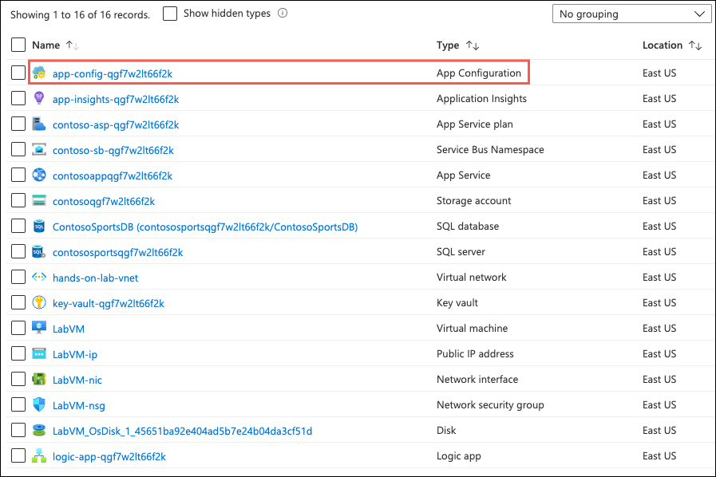
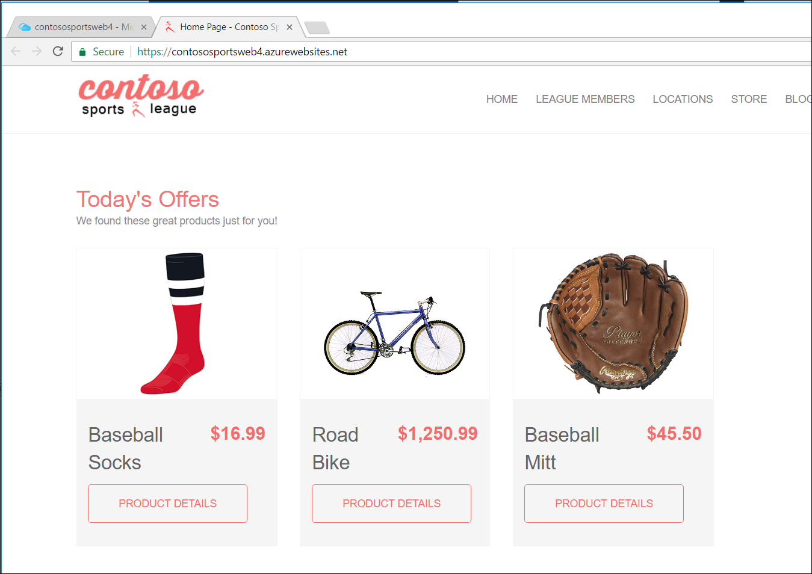

# Challenge 7: Add API endpoint configuration settings

**Duration**: 15 minutes

In this challenge, you add the API endpoints to your App Configuration resource.

- [Challenge 7: Add API endpoint configuration settings](#challenge-7-add-api-endpoint-configuration-settings)
  - [Task 1: Add the API endpoint configuration settings](#task-1-add-the-api-endpoint-configuration-settings)
  - [Task 2: Validate App Settings are correct](#task-2-validate-app-settings-are-correct)

## Task 1: Add the API endpoint configuration settings

1. Return to the **hands-on-lab-SUFFIX** resource group and select the **App Configuration** resource from the list.

    

2. Select **Configuration explorer** from the left-hand navigation menu and then expand **Create** and select **Key-value**. This API endpoint does not contain any secret values, thus is not required to be stored as a Key Vault value.

    

3. Create the new key-value entry with the following values:

   - **Name**: `APIEndpoints:PaymentsAPI`
   - Value: Enter the **HTTPS** URL for the Payments API App with `/api/nvp` appended to the end. This is the value that you recorded when deploying the API. Alternatively, this value can be retrieved by opening the API resource in the Azure Portal and copying the URL value on the Overview screen.

        >**Example**: `https://contoso-payments-api.azurewebsites.net/api/nvp`

4. Create another Key-value setting with the following values:

   - App Setting Name: `APIEndpoints:OffersAPI`

   - Value: Enter the **HTTPS** URL for the Offers API App with `/api/get` appended to the end. This is the value that you recorded when deploying the API. Alternatively, this value can be retrieved by opening the API resource in the Azure Portal and copying the URL value on the Overview screen.

    >**Example**: `https://contoso-offers-api.azurewebsites.net/api/get`

    >**Note**: Ensure both API URLs are using **SSL** (https://), or you will see a CORS errors.

    

## Task 2: Validate App Settings are correct

1. Return to the **hands-on-lab-SUFFIX** resource group and select the **contosoapp** App Service resource.

   

2. On the **App Service** blade, select the **URL** of the Web App displayed in the Essentials area to open it in a new browser tab.

    

3. On the homepage, you should see the latest offers populated from the Offers API.

    

    > **Note**: The page may be cached, if Today's Offers are not displayed, **you may need to re-publish the e-commerce app service from Visual Studio (Contoso.Apps.SportsLeague.Web)**.

4. Submit several test orders to ensure all pieces of the site are functional. **Accept the default data during the payment processing.**

    

> **Note**: If you are still experiencing CORS errors, review that all URLs in the application configuration resource are correct and are using SSL.
