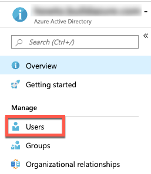
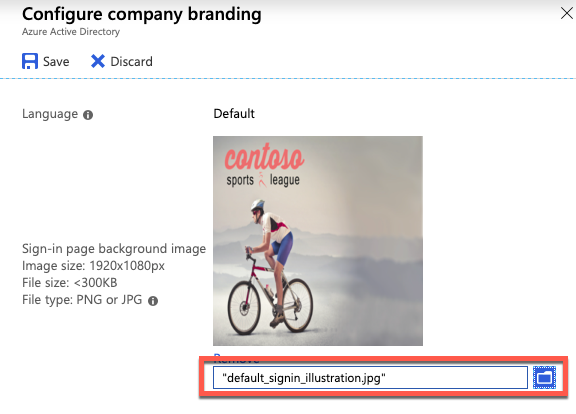
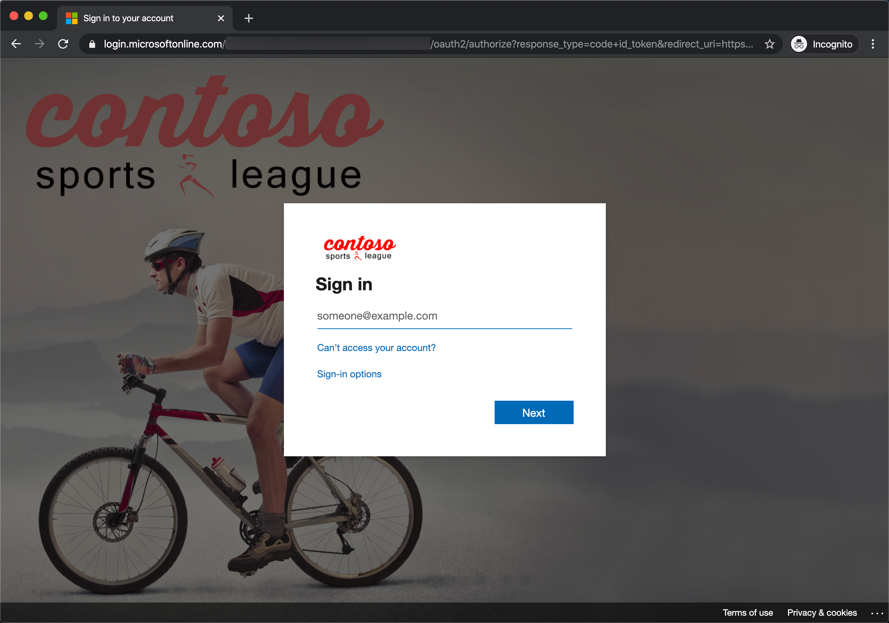

# Challenge 8: Identity and Security (Optional)

**Duration**: 75 Minutes

The Contoso call center admin application will only be accessible by users of the Contoso Active Directory environment. You have been asked to create a new Azure AD Tenant and secure the application so only users from the tenant can log on.

- [Challenge 8: Identity and Security (Optional)](#challenge-8-identity-and-security-optional)
  - [Task 1: Enable Azure AD Premium Trial](#task-1-enable-azure-ad-premium-trial)
  - [Task 2: Create a new Contoso user](#task-2-create-a-new-contoso-user)
  - [Task 3: Configure access control for the call center administration Web Application](#task-3-configure-access-control-for-the-call-center-administration-web-application)
  - [Task 4: Apply custom branding for the Azure Active Directory logon page](#task-4-apply-custom-branding-for-the-azure-active-directory-logon-page)
  - [Task 5: Verify the branding has been successfully applied to the Azure Active Directory logon page](#task-5-verify-the-branding-has-been-successfully-applied-to-the-azure-active-directory-logon-page)

## Task 1: Enable Azure AD Premium Trial

>**Note**: This task is **optional**, and it is valid only if you are a global administrator on the Azure AD tenant associated with your subscription.

1. Navigate to the home page of the [Azure portal](http://portal.azure.com/) and select **Azure Active Directory**. under Azure Services.

    > **Note**: If you do not see Azure Active Directory, select More Services, and then select it there.

    

2. On the **Azure Active Directory** blade, locate and select the **Company branding** option in the left-hand navigation menu.

    

3. In the right pane, select the **Get Free Premium Trial** button.

    

    If you already have a Premium Azure Active Directory, skip to Task 2.

4. On the **Activate** blade, expand **Free trial** under **Azure AD Premium P2**, then select **Activate**.

    

5. Close the **Azure Active Directory** blades.

## Task 2: Create a new Contoso user

> **Note**: This task is **optional**, and it is valid only if you are a global administrator on the Azure AD tenant associated with your subscription.

1. On the **Azure Active Directory** blade, select **Custom domain names**.

    

2. Copy the **Domain Name** for your Azure AD Tenant. It will be in the format: *[your tenant].onmicrosoft.com*.
    This will be used for creating the new user's Username.

    

3. On the **Azure Active Directory** blade, select **Users**.

    

4. On the **User** blade, enter the following:

    **Identity**:

    - **User name**: Enter a username and select the domain name for your Azure AD Tenant. For example: *tbaker@[your tenant].onmicrosoft.com*.
    - **Name**: Enter the name of the user.
    - **Password**: Select **Auto-generate** and then check **Show password**. Copy this value into a text editor for later user.

    

5. Select **Create**.

## Task 3: Configure access control for the call center administration Web Application

> **Note**: This task is **optional**, and it is valid only if you have the right to create applications in your Azure AD Tenant.

1. Return to the **hands-on-lab-SUFFIX** resource group and select the **Call Center Administration web app** App Service resource.

   

2. On the **App Service** blade, select the **Authentication** from the left-hand navigation menu and then select **Add Identity Provider**.

    

3. On the **Add an identity provider** dialog, enter the following:

    - **Identity provider**: Select **Microsoft**.
    - **App registration type**: Choose **Create new app registration**.
    - **Name**: Accept the default value entered into this box.
    - **Supported account types**: Choose **Current tenant - Single tenant**.
    - **Authentication**: Choose **Require authentication**.
    - **Unauthenticated requests**: Choose **HTTP 302 Found redirect: recommended for web sites**.
    - **Token store**: Check this box.

    

4. Select **Add**.

5. Launch a new **In-Private or Incognito mode** browser window and navigate to the **Call Center Administration** website. You can find the URL in the Essentials area of the web app's blade in the Azure portal.

6. The browser will redirect to the non-branded Access Control logon URL. You can log on with your Microsoft account or the **Contoso test user** you created earlier.

    

7. On the **Permissions requested** page, select **Accept**.

    

8. After you log on and **accept the consent**, your browser will be redirected to the Contoso Sports League Admin webpage.

    

## Task 4: Apply custom branding for the Azure Active Directory logon page

> **Note**: this task is **optional**, and it is valid only if you are a global administrator on the Azure AD tenant associated with your subscription, and you completed the Enabling Azure AD Premium challenge.

1. Navigate to the home page of the [Azure portal](http://portal.azure.com/) and select **Azure Active Directory**. under Azure Services.

    > **Note**: If you do not see Azure Active Directory, select More Services, and then select it there.

    

2. On the **Azure Active Directory** blade, locate and select the **Company branding** option in the left-hand navigation menu.

    

3. Select the **Configure...** information box.

    

4. On the **Configure company branding** blade, select the `default_signin_illustration.jpg` image file from `C:\MCW` for the **Sign-in page image**.

    

5. Select the `logo-60-280.png` image file from the supplementary files for the **Banner image**.

    

6. Select **Save**.

    

## Task 5: Verify the branding has been successfully applied to the Azure Active Directory logon page

1. Close any previously authenticated browser sessions to the call center administration website, reopen using InPrivate or Incognito mode, and navigate to the **call center administration** website.

2. The browser will redirect to the branded access control logon URL.

    

3. After you log on, your browser will be redirected to the Contoso Sports League Admin webpage.

    

    >**Note**: If you run the app using localhost, ensure connection strings within all the appsettings.json files in the solution have the placeholders removed with actual values. Search on appsettings.json in the Visual Studio Solution Explorer to come up with the list.
