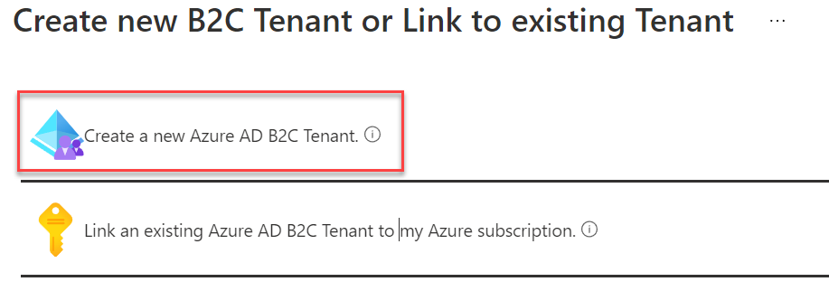
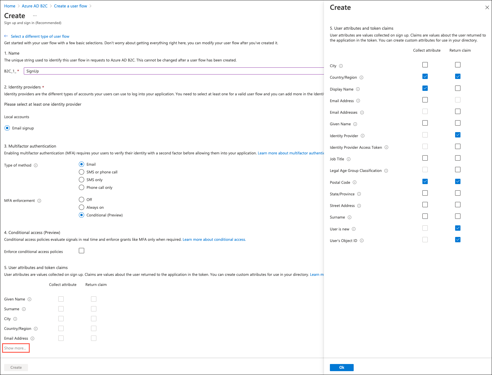
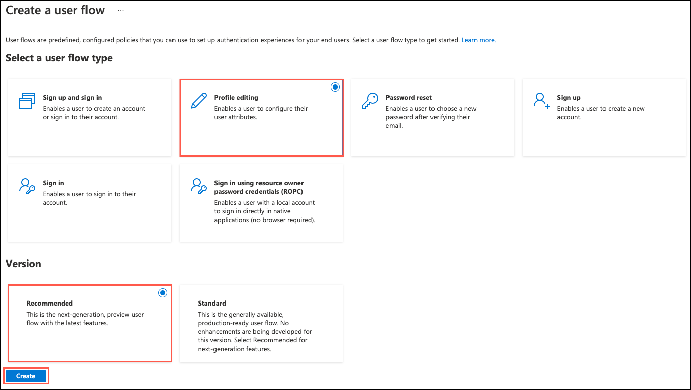

# Challenge 9: Enable Azure B2C for customer site

**Duration**: 75 minutes

In this challenge, you will configure an Azure AD Business to Consumer (B2C) instance to enable authentication and policies for sign-in, sign-out and profile policies for the Contoso E-Commerce site.

- [Challenge 9: Enable Azure B2C for customer site](#challenge-9-enable-azure-b2c-for-customer-site)
  - [Task 1: Create a new directory](#task-1-create-a-new-directory)
  - [Task 2: Add a new application](#task-2-add-a-new-application)
  - [Task 3: Create Policies, Sign up and sign in](#task-3-create-policies-sign-up-and-sign-in)
  - [Task 4: Create a profile editing policy](#task-4-create-a-profile-editing-policy)
  - [Task 5: Create a password reset policy](#task-5-create-a-password-reset-policy)
  - [Task 6: Modify the Contoso.App.SportsLeague.Web](#task-6-modify-the-contosoappsportsleagueweb)
  - [Task 7: Send authentication requests to Azure AD](#task-7-send-authentication-requests-to-azure-ad)
  - [Task 8: Display user information](#task-8-display-user-information)
  - [Task 9: Update App Service configuration](#task-9-update-app-service-configuration)
  - [Task 10: Run the sample app](#task-10-run-the-sample-app)

## Task 1: Create a new directory

1. Navigate to the [Azure portal](https://portal.azure.com/) and in the left-hand navigation menu, select **+Create a resource**. Then, search for and select **Azure Active Directory B2C** and select **Create** on the new blade that pops up.

2. On the **Create new B2C Tenant or Link to existing Tenant**, select **Create a new Azure AD B2C Tenant**.

    

3. On the **Create a tenant** blade's **Configuration** tab, enter the following:

    **Directory details**:

    - **Organization name**: Enter `ContosoB2C`.
    - **Initial domain name**: Enter `contososportsorgSUFFIX`, where suffix is a unique identifier, such as `24601`, to ensure the domain name is globally unique.
    - **Country/Region**: Select the region most appropriate for your location.

    **Subscription**:

    - **Subscription**: Select the subscription you are using for this hand-on lab.
    - **Resource group**: Select the **ContosoSports** resource group.

    

4. Select **Review + create**, then **Create** on the review + create tab.

5. After directory creation completes, select the link in the new information tile that reads **Click here to navigate to your new directory**.

    

6. The new Azure AD Directory that was created will now be open in new browser tab.

## Task 2: Add a new application

1. In the **Azure AD B2C** browser tab, select **App registrations** under the **MANAGE** menu area and then select **New registration**.

    

2. Specify the following configuration options for the new Application registration:

    - **Name**: Enter `Contoso B2C Application`.
    - **Supported account types**: Choose **Accounts in any identity provider or organizational directory (for authenticating users with user flows)**.
    - **Redirect URI**: Select **Web** and then enter the URL using the format, `https://[your-web-app-name].azurewebsites.net/signin-oidc-b2c`, replacing `[your-web-app-name] with the name of the App Service hosting the Contoso E-Commerce Site.
    - **Permissions**: Leave the **Grant admin consent to openid and offline_access permissions** checkbox checked.

        

3. Select **Register**.

4. Once App registration has completed, copy the **Application (client) ID** of your new application to Notepad to use later. Keep this tab open for the next task.

     

5. Next, select **Authentication** from the left-hand navigation menu of the **Contoso B2C Application** page.

    

6. On the **Authentication** blade, scroll down and locate the **Implicit grant and hybrid flows** section. Within that section, check the **Access tokens** and **ID tokens** boxes and then select **Save** in the toolbar at the top of the blade.

    

## Task 3: Create Policies, Sign up and sign in

1. Navigate back to the **Azure AD B2C** screen.

2. To enable sign-up on your application, you will need to create a sign-up policy. This policy describes the experiences consumers will go through during sign-up and the contents of tokens the application will receive on successful sign-ups. Select **User flows** link on the left menu and then **New user flow** link at the top of the blade.

    

3. Select the **Sign up and sign in** tile, then under Version, select **Recommended**, then select the **Create** button.
  
    

4. On the **Create** screen, enter the following:

    **Name**:

    - **B2C_1_**: Enter `SignUp`.
  
    **Identity providers**:

    - **Local accounts**: Select **Email signup**.

    **Multifactor authentication**:

    - **Type of method**: Leave **Email** selected.
    - **MFA enforcement**: Choose **Conditional**. This will disable MFA for this challenge.

    **Conditional access**:

    - **Enforce conditional access policies**: Ensure this box is **unchecked**.

    **User attributes and token claims**:

    - Select **Show more...** and on the **User attributes and token claims** dialog, set the following and then select **OK**:

    | Attribute name                 | Collect Attribute | Return claim |
    | ------------------------------ | ----------------- | ------------ |
    | City                           | Unchecked         | Unchecked    |
    | Country/Region                 | **Checked**       | Unchecked    |
    | Display Name                   | **Checked**       | **Checked**  |
    | Email Address                  | Unchecked         | Unchecked    |
    | Given Name                     | Unchecked         | Unchecked    |
    | Identify Provider              | Unchecked         | **Checked**  |
    | Identify Provider Access Token | Unchecked         | Unchecked    |
    | Job Title                      | Unchecked         | Unchecked    |
    | Legal Age Group Classification | Unchecked         | Unchecked    |
    | Postal Code                    | **Checked**       | **Checked**  |
    | State/Province                 | Unchecked         | Unchecked    |
    | Street Address                 | Unchecked         | Unchecked    |
    | Surname                        | Unchecked         | Unchecked    |
    | User is new                    | Unchecked         | **Checked**  |
    | User's Object ID               | Unchecked         | **Checked**  |

    

5. Select **Create**. The sign-in/sign-up policy appears as **B2C_1_SignUp** (the **B2C_1_** fragment is automatically added) in the **User flows** blade.

    > **Note**: The page may take a few minutes to load/refresh after you start creating the policy.

    

6. Open the policy by selecting **B2C_1_SignUp**.

7. Select **Run user flow** and open the dialog.

    

8. Select **Run user flow** on the **Run user flow** dialog.

    

9. In the browser window that opens, select **Sign up now**.

    

10. On the sign up dialog, enter your email address and select **Send verification code**.

    > **Important**: You must enter a valid email address that you have access to for this lab.

    

11. Check your email for a message from **Microsoft on behalf of ContosoB2C** and copy the code provided.

    

12. Return to the **Sign Up** browser window and enter the code into the provided field, then select **Verify code**.

    

13. Enter a password and complete the remaining fields on the form and then select **Create**.

    

14. After you select **Create**, you will get a 404 error page which should look something like the below screenshot. This happens because the Contoso web app has not yet been configured to use Azure AD B2C. You will do this below, so **the error can be ignored**.

    

## Task 4: Create a profile editing policy

To enable profile editing on your application, you will need to create a profile editing policy. This policy describes the experiences that consumers will go through during profile editing and the contents of tokens that the application will receive on successful completion.

1. On the **User flows** blade, select **New user flow** again on the toolbar.

2. For the **Select a user flow type**, select the **Profile editing** tile, then select **Recommended**, and then select **Create**.

    

3. On the **Create** screen, enter the following:

    **Name**:

    - **B2C_1_**: Enter `EditProfile`.
  
    **Identity providers**:

    - **Local accounts**: Select **Email signin**.

    **Multifactor authentication**:

    - **Type of method**: Leave **Email** selected.
    - **MFA enforcement**: Choose **Conditional**. This will disable MFA for this challenge.

    **Conditional access**:

    - **Enforce conditional access policies**: Ensure this box is **unchecked**.

    **User attributes and token claims**:

    - Select **Show more...** and on the **User attributes and token claims** dialog, set the following and then select **OK**:

    | Attribute name                 | Collect Attribute | Return claim |
    | ------------------------------ | ----------------- | ------------ |
    | City                           | Unchecked         | Unchecked    |
    | Country/Region                 | **Checked**       | Unchecked    |
    | Display Name                   | **Checked**       | **Checked**  |
    | Email Address                  | Unchecked         | Unchecked    |
    | Given Name                     | Unchecked         | Unchecked    |
    | Identify Provider              | Unchecked         | Unchecked    |
    | Identify Provider Access Token | Unchecked         | Unchecked    |
    | Job Title                      | **Checked**       | Unchecked    |
    | Legal Age Group Classification | Unchecked         | Unchecked    |
    | Postal Code                    | **Checked**       | **Checked**  |
    | State/Province                 | **Checked**       | Unchecked    |
    | Street Address                 | **Checked**       | Unchecked    |
    | Surname                        | Unchecked         | Unchecked    |
    | User's Object ID               | Unchecked         | Unchecked    |

    

4. Select **Create**. The edit profile policy appears as **B2C_1_EditProfile** in the **User flows** blade.

5. Optionally, you can run the edit profile user flow by selecting the **B2C_1_EditProfile** flow and then selecting **Run user flow**.

6. Select **Run user flow** and in the new browser window, sign in with the email address and password you used to sign up for an account, and then you can edit your profile details.

    > **Important**: As with the sign-up user flow, you will get an error after saving any profile updates, as the Contoso Sports web app has not yet been updated to use Azure AD B2C.

## Task 5: Create a password reset policy

To enable profile editing on your application, you will need to create a profile password reset. This policy describes the experiences that consumers will go through during password reset and the contents of tokens that the application will receive on successful completion.

1. On the **User flows** blade, select **New user flow** again on the toolbar.

2. For the **Select a user flow type**, select the **Password reset** tile, then select **Recommended**, and then select **Create**.

    

3. On the **Create** screen, enter the following:

    **Name**:

    - **B2C_1_**: Enter `PasswordReset`.
  
    **Identity providers**:

    - **Local accounts**: Select **Reset password using email address**.

    **Multifactor authentication**:

    - **Type of method**: Leave **Email** selected.
    - **MFA enforcement**: Choose **Conditional**. This will disable MFA for this challenge.

    **Conditional access**:

    - **Enforce conditional access policies**: Ensure this box is **unchecked**.

    **User attributes and token claims**:

    - Select **Show more...** and on the **User attributes and token claims** dialog, set the following and then select **OK**:

    | Attribute name                 | Return claim |
    | ------------------------------ | ------------ |
    | City                           | Unchecked    |
    | Country/Region                 | Unchecked    |
    | Display Name                   | Unchecked    |
    | Email Address                  | **Checked**  |
    | Given Name                     | **Checked**  |
    | Job Title                      | Unchecked    |
    | Legal Age Group Classification | Unchecked    |
    | Postal Code                    | Unchecked    |
    | State/Province                 | Unchecked    |
    | Street Address                 | Unchecked    |
    | Surname                        | Unchecked    |
    | User's Object ID               | Unchecked    |

    

4. Select **Create**. The edit profile policy appears as **B2C_1_PasswordReset** in the **User flows** blade.

5. Optionally, you can run the password reset user flow by selecting the **B2C_1_PasswordReset** flow and then selecting **Run user flow**.

6. Select **Run user flow** and in the new browser window, enter the email address you used to sign up for an account, select **Send verification code** and then follow the remaining steps to reset your password.

    > **Important**: As with the sign-up user flow, you will get an error after saving any profile updates, as the Contoso Sports web app has not yet been updated to use Azure AD B2C.

## Task 6: Modify the Contoso.App.SportsLeague.Web

1. In Visual Studio, expand the **Contoso.Apps.SportsLeague.Web** project within the Solution Explorer. then locate and open the `Startup.cs` code file.

2. Add the following `using` directives to the top of the `Startup.cs` code file:

    ```csharp
    using Microsoft.AspNetCore.Authentication;
    using Microsoft.AspNetCore.Authentication.AzureADB2C.UI;
    ```

3. Locate the `public void ConfigureServices` method declaration and add the following line of code to the bottom of this method:

    ```csharp
    services.AddAuthentication(Microsoft.AspNetCore.Authentication.AzureADB2C.UI.AzureADB2CDefaults.AuthenticationScheme)
                .AddAzureADB2C(options => Configuration.Bind("AzureADB2C", options));
    ```

    

4. Locate the `app.UseAuthorization();` line within the `public void Configure` method, and add the following line of code before it:

    ```csharp
    app.UseAuthentication();
    ```

    The result will look similar to the following:

    

5. Select **Save** on the toolbar to save the `Startup.cs` file.

## Task 7: Send authentication requests to Azure AD

Your app is now configured to communicate with Azure AD B2C by using ASP.NET Core Identity. OWIN has taken care of all the details of crafting authentication messages, validating tokens from Azure AD, and maintaining user session. All that remains is to initiate each user's flow.

1. Right select the **Controllers** folder and select **Add** -> **Controller**.

    

2. Select **MVC Controller - Empty** and then select **Add**. Replace default name of **HomeController1.cs** with the name of **AccountController.cs** for the new Controller being added.

    

3. Add the following using statements to the top of the controller, below the existing using statements:

    ```csharp
    using Microsoft.AspNetCore.Authentication;
    using Microsoft.AspNetCore.Authentication.AzureADB2C.UI;
    using Microsoft.Extensions.Configuration;
    ```

4. Locate the default controller **Index** method.

    

5. Replace the method with the following code:

    ```csharp
    private string _editProfilePolicyId;

    public AccountController(IConfiguration configuration)
    {
        _editProfilePolicyId = configuration.GetValue<string>("AzureADB2C:EditProfilePolicyId");
    }

    public ActionResult SignIn()
    {
        if (!User.Identity.IsAuthenticated)
        {
            return Challenge(new AuthenticationProperties() { RedirectUri = "/" }, AzureADB2CDefaults.AuthenticationScheme);
        }
        return RedirectToAction("Index", "Home");
    }

    public ActionResult SignUp()
    {
        if (!User.Identity.IsAuthenticated)
        {
            return Challenge(new AuthenticationProperties() { RedirectUri = "/" }, AzureADB2CDefaults.AuthenticationScheme);
        }
        return RedirectToAction("Index", "Home");
    }

    public ActionResult Profile()
    {
        if (User.Identity.IsAuthenticated)
        {
                var properties = new AuthenticationProperties() { RedirectUri = "/" };
                properties.Items[AzureADB2CDefaults.PolicyKey] = _editProfilePolicyId;
                return Challenge(
                    properties,
                    AzureADB2CDefaults.AuthenticationScheme);
        }
        return RedirectToAction("Index", "Home");
    }

    public ActionResult SignOut()
    {
        if (!User.Identity.IsAuthenticated)
        {
            return RedirectToAction("Index", "Home");
        }
        string redirectUri = Url.Action("Index", "Home", null, Request.Scheme);
        var properties = new AuthenticationProperties
        {
            RedirectUri = redirectUri
        };
        return SignOut(properties, AzureADB2CDefaults.CookieScheme, AzureADB2CDefaults.OpenIdScheme);
    }
    ```

6. Save the file by selecting **Save** on the Visual Studio toolbar.

## Task 8: Display user information

When you authenticate users by using OpenID Connect, Azure AD returns an ID token to the app that contains **claims**. These are assertions about the user. You can use claims to personalize your app. You can access user claims in your controllers via the ClaimsPrincipal.Current security principal object.

1. Open the **Controllers\\HomeController.cs** file and add the following using statements at the end of the other using statements at the top of the file, below the existing using statements:

    ```csharp
    using Microsoft.AspNetCore.Authorization;
    ```

2. Next, add the following method to the **HomeController** class:

    ```csharp
    [Authorize]
    public ActionResult Claims()
    {
        var displayName = User.Identity.Name;
        ViewBag.DisplayName = displayName;
        ViewBag.Claims = User.Claims;
        return View();
    }
    ```

3. To access the claims that your application receives, you will create a new claims view that will display a list of all the claims the app receives. In the Visual Studio Solution Explorer, expand the **Views -\> Home** folder under the **Contoso.Apps.SportsLeague.Web** project, right-click the **Home** folder, and then select **Add -\> View**.

    

4. On the **Add New Scaffolded Item** dialog, select **Razor View - Empty** and select **Add**.

    

5. On the **Add New Item** dialog, enter **Claims.cshtml** as the name of the new view and then select **Add**.

    

6. In the new **Claims.cshtml** file that opens in Visual Studio, replace all the file's contents with the following code:

    ```csharp
    @using System.Security.Claims
    @{
        ViewBag.Title = "Claims";
    }
    <h2>@ViewBag.Title</h2>

    <h4>Claims Present in the Claims Identity: @ViewBag.DisplayName</h4>

    <table class="table-hover claim-table">
        <tr>
            <th class="claim-type claim-data claim-head">Claim Type</th>
            <th class="claim-data claim-head">Claim Value</th>
        </tr>

        @foreach (Claim claim in ViewBag.Claims)
        {
            <tr>
                <td class="claim-type claim-data">@claim.Type</td>
                <td class="claim-data">@claim.Value</td>
            </tr>
        }
    </table>
    ```

7. Select **Save** on the toolbar in Visual Studio to save the `Claims.cshtml` file.

8. Next, you will create a partial view to handle logging users in and out under the **Shared** folder. Right-click on the **Views -\> Shared** folder, select **Add**, add a new **View**.

9. On the **Add New Scaffolded Item** dialog, select **Razor View - Empty** and select **Add**.

10. On the **Add New Item** dialog, enter **\_LoginPartial.cshtml** for the name (making sure to include the leading underscore, "_", in the file name) and then select **Add**.

11. Replace all contents of the file with the following code to create a razor partial view to provide a sign-in and sign-out link as well as a link to edit the user's profile:

    ```html
    @if (User.Identity.IsAuthenticated)
    {
        <text>
            <ul class="nav navbar-nav navbar-right">
                <li>
                    <a id="profile-link">@User.Identity.Name</a>
                    <div id="profile-options" class="nav navbar-nav navbar-right">
                        <ul class="profile-links">
                            <li class="profile-link">
                                @Html.ActionLink("Edit Profile", "Profile", "Account")
                            </li>
                        </ul>
                    </div>
                </li>
                <li>
                    @Html.ActionLink("Sign out", "SignOut", "Account")
                </li>
            </ul>
        </text>
    }
    else
    {
        <ul class="nav navbar-nav navbar-right">
            <li>@Html.ActionLink("Sign up", "SignUp", "Account", routeValues: null, htmlAttributes: new { id = "signUpLink" })</li>
            <li>@Html.ActionLink("Sign in", "SignIn", "Account", routeValues: null, htmlAttributes: new { id = "loginLink" })</li>
        </ul>
    }
    ```

12. Select **Save** on the toolbar in Visual Studio to save the `_LoginPartial.cshtml` file.

13. Open `Views\Shared\_Layout.cshtml` in Visual Studio.

14. Locate the **DIV** markdown element that has the class of `header-top` (line 46 of the file), and add the line that starts with `@Html.ActionLink` and the line that starts with `@Html.Partial`.

    ```html
    <div class="header-top">
        <div class="container">
            <div class="row">
                <div class="header-top-left">
                <a href="#"><i class="fa fa-twitter"></i></a>
                <a href="#"><i class="fa fa-facebook"></i></a>
                <a href="#"><i class="fa fa-linkedin"></i></a>
                <a href="#"><i class="fa fa-instagram"></i></a>
                </div>
                <div class="header-top-right">
                    <a href="#" class="top-wrap"><span class="icon-phone">Call today: </span> (555) 555-8000</a>
                    @Html.ActionLink("Claims", "Claims", "Home")
                </div>
                @Html.Partial("_LoginPartial")
            </div>
        </div>
    </div>
    ```

## Task 9: Update App Service configuration

In this task, you update the configuration settings for the deployed web app in the Azure portal.

1. Return to the [Azure portal](https://portal.azure.com/), navigate to the **hands-on-lab-SUFFIX** resource group, and locate the Azure AD B2C resource. Copy the name portion of the **B2C tenant** and pasted it into a text edit, such as Notepad.exe.

    > **Note**: The name portion of the tenant is everything leading up to the first period (.) in the resource name. So, you will exclude `.onmicrosoft.com` from what you copy and paste into the text editor.

    

2. While still on the **hands-on-lab-SUFFIX** resource group blade in the Azure portal, select the Contoso Web App resource, and then select **Configuration** on the web app blade.

3. Add the following settings in the **Application Settings** section:

   - AzureADB2C:Instance - `https://[your-AAD-B2C-tenant-name].b2clogin.com/tfp/`
   - AzureADB2C:ClientId - **B2C Application ID you copied down earlier**.
   - AzureADB2C:CallbackPath - `/signin-oidc-b2c`
   - AzureADB2C:Domain - `[your-AAD-B2C-tenant-name]`.onmicrosoft.com**
   - AzureADB2C:SignUpSignInPolicyId - `B2C_1_SignUp`
   - AzureADB2C:ResetPasswordPolicyId - `B2C_1_PasswordReset`
   - AzureADB2C:EditProfilePolicyId - `B2C_1_EditProfile`

4. Select **Save** on the toolbar.

## Task 10: Run the sample app

In this task, you re-deploy the web app to your App Service and test the app using Azure AD B2C.

1. Go back to Visual Studio, right-click on the **Contoso.Apps.SportsLeague.Web** project and select **Publish**. Follow the steps to deploy the updated application to the Microsoft Azure Web App.

    Launch a browser outside of Visual Studio for testing if the page loads in Visual Studio.

2. Test out Sign up.

3. Next, test Sign out.

4. When you select Claims and are not signed in, it will bring you to the sign-in page and then display the claim information. Sign in, and test Edit Profile.

    

    Claims information page:

    
