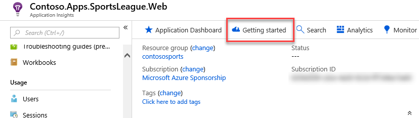

# Challenge 10: Enabling Telemetry with Application Insights

**Duration**: 30 Minutes

To configure the application for logging and diagnostics, you have been asked to configure Microsoft Azure Application Insights and add some custom telemetry.

- [Challenge 10: Enabling Telemetry with Application Insights](#challenge-10-enabling-telemetry-with-application-insights)
  - [Task 1: Add Application Insights Telemetry to the e-commerce website project](#task-1-add-application-insights-telemetry-to-the-e-commerce-website-project)
  - [Task 2: Enable client side telemetry](#task-2-enable-client-side-telemetry)
  - [Task 3: Deploy the e-commerce Web App from Visual Studio](#task-3-deploy-the-e-commerce-web-app-from-visual-studio)
  - [Task 4: View the Application Insights logs](#task-4-view-the-application-insights-logs)

## Task 1: Add Application Insights Telemetry to the e-commerce website project

1. Open the Solution **Contoso.Apps.SportsLeague** in Visual Studio.

2. Navigate to the **Contoso.Apps.SportsLeague.Web** project located in the **Web** folder using the **Solution Explorer** in Visual Studio.

3. Expand the **Contoso.Apps.SportsLeague.Web** project, then right-click on the **Dependencies** node, and select **Manage NuGet Packages...**.

4. Within the **NuGet Package Manager**, select the **Browse** tab, then search for and install the following NuGet package:

    - **Microsoft.ApplicationInsights.AspNetCore**

5. Open the file `\Helpers\TelemetryHelper.cs` located in the **Contoso.Apps.SportsLeague.Web** project.

6. Add the following using statements to the top of the file:

    ```csharp
    using Microsoft.ApplicationInsights;
    using Microsoft.ApplicationInsights.Extensibility;
    ```

7. Add the following code to the **TrackException** method to instantiate the telemetry client and track exceptions:

    ```csharp
    var client = new TelemetryClient(TelemetryConfiguration.CreateDefault());
    client.TrackException(new Microsoft.ApplicationInsights.DataContracts.ExceptionTelemetry(exc));
    ```

8. Add the following code to the **TrackEvent** method to instantiate the telemetry client and track event data:

    ```csharp
    var client = new TelemetryClient(TelemetryConfiguration.CreateDefault());
    client.TrackEvent(eventName, properties);
    ```

9. Save the `TelemetryHelper.cs` file.

## Task 2: Enable client side telemetry

1. Return to the **hands-on-lab-SUFFIX** Resource Group and select the **Application Insights** resource.

    

2. Copy the **Instrumentation Key** value in the Essentials area of the Overview blade by selecting the **Copy to clipboard** icon to the right of the key value.

    

3. Select **Getting Started** on the toolbar of the Application Insights blade.

    

4. In the portal, navigate to **How-to Guides** -> **Application Insights** -> **Application Insights SDKs** -> **JavaScript** -> **Client-side JavaScript**, then navigate to the **Snippet based setup** section under **Adding the JavaScript SDK** within the documentation page.

    

    > **Note**: You can find the documentation page at the following URL: <https://docs.microsoft.com/azure/azure-monitor/app/javascript#snippet-based-setup>.

5. Select and copy the full contents of the JavaScript under the **Snippet based setup** heading.

    

    Here's the JavaScript code to copy/paste for quick reference:

    ```javascript
    <script type="text/javascript">
    !function(T,l,y){var S=T.location,k="script",D="instrumentationKey",C="ingestionendpoint",I="disableExceptionTracking",E="ai.device.",b="toLowerCase",w="crossOrigin",N="POST",e="appInsightsSDK",t=y.name||"appInsights";(y.name||T[e])&&(T[e]=t);var n=T[t]||function(d){var g=!1,f=!1,m={initialize:!0,queue:[],sv:"5",version:2,config:d};function v(e,t){var n={},a="Browser";return n[E+"id"]=a[b](),n[E+"type"]=a,n["ai.operation.name"]=S&&S.pathname||"_unknown_",n["ai.internal.sdkVersion"]="javascript:snippet_"+(m.sv||m.version),{time:function(){var e=new Date;function t(e){var t=""+e;return 1===t.length&&(t="0"+t),t}return e.getUTCFullYear()+"-"+t(1+e.getUTCMonth())+"-"+t(e.getUTCDate())+"T"+t(e.getUTCHours())+":"+t(e.getUTCMinutes())+":"+t(e.getUTCSeconds())+"."+((e.getUTCMilliseconds()/1e3).toFixed(3)+"").slice(2,5)+"Z"}(),iKey:e,name:"Microsoft.ApplicationInsights."+e.replace(/-/g,"")+"."+t,sampleRate:100,tags:n,data:{baseData:{ver:2}}}}var h=d.url||y.src;if(h){function a(e){var t,n,a,i,r,o,s,c,u,p,l;g=!0,m.queue=[],f||(f=!0,t=h,s=function(){var e={},t=d.connectionString;if(t)for(var n=t.split(";"),a=0;a<n.length;a++){var i=n[a].split("=");2===i.length&&(e[i[0][b]()]=i[1])}if(!e[C]){var r=e.endpointsuffix,o=r?e.location:null;e[C]="https://"+(o?o+".":"")+"dc."+(r||"services.visualstudio.com")}return e}(),c=s[D]||d[D]||"",u=s[C],p=u?u+"/v2/track":d.endpointUrl,(l=[]).push((n="SDK LOAD Failure: Failed to load Application Insights SDK script (See stack for details)",a=t,i=p,(o=(r=v(c,"Exception")).data).baseType="ExceptionData",o.baseData.exceptions=[{typeName:"SDKLoadFailed",message:n.replace(/\./g,"-"),hasFullStack:!1,stack:n+"\nSnippet failed to load ["+a+"] -- Telemetry is disabled\nHelp Link: https://go.microsoft.com/fwlink/?linkid=2128109\nHost: "+(S&&S.pathname||"_unknown_")+"\nEndpoint: "+i,parsedStack:[]}],r)),l.push(function(e,t,n,a){var i=v(c,"Message"),r=i.data;r.baseType="MessageData";var o=r.baseData;return o.message='AI (Internal): 99 message:"'+("SDK LOAD Failure: Failed to load Application Insights SDK script (See stack for details) ("+n+")").replace(/\"/g,"")+'"',o.properties={endpoint:a},i}(0,0,t,p)),function(e,t){if(JSON){var n=T.fetch;if(n&&!y.useXhr)n(t,{method:N,body:JSON.stringify(e),mode:"cors"});else if(XMLHttpRequest){var a=new XMLHttpRequest;a.open(N,t),a.setRequestHeader("Content-type","application/json"),a.send(JSON.stringify(e))}}}(l,p))}function i(e,t){f||setTimeout(function(){!t&&m.core||a()},500)}var e=function(){var n=l.createElement(k);n.src=h;var e=y[w];return!e&&""!==e||"undefined"==n[w]||(n[w]=e),n.onload=i,n.onerror=a,n.onreadystatechange=function(e,t){"loaded"!==n.readyState&&"complete"!==n.readyState||i(0,t)},n}();y.ld<0?l.getElementsByTagName("head")[0].appendChild(e):setTimeout(function(){l.getElementsByTagName(k)[0].parentNode.appendChild(e)},y.ld||0)}try{m.cookie=l.cookie}catch(p){}function t(e){for(;e.length;)!function(t){m[t]=function(){var e=arguments;g||m.queue.push(function(){m[t].apply(m,e)})}}(e.pop())}var n="track",r="TrackPage",o="TrackEvent";t([n+"Event",n+"PageView",n+"Exception",n+"Trace",n+"DependencyData",n+"Metric",n+"PageViewPerformance","start"+r,"stop"+r,"start"+o,"stop"+o,"addTelemetryInitializer","setAuthenticatedUserContext","clearAuthenticatedUserContext","flush"]),m.SeverityLevel={Verbose:0,Information:1,Warning:2,Error:3,Critical:4};var s=(d.extensionConfig||{}).ApplicationInsightsAnalytics||{};if(!0!==d[I]&&!0!==s[I]){var c="onerror";t(["_"+c]);var u=T[c];T[c]=function(e,t,n,a,i){var r=u&&u(e,t,n,a,i);return!0!==r&&m["_"+c]({message:e,url:t,lineNumber:n,columnNumber:a,error:i}),r},d.autoExceptionInstrumented=!0}return m}(y.cfg);function a(){y.onInit&&y.onInit(n)}(T[t]=n).queue&&0===n.queue.length?(n.queue.push(a),n.trackPageView({})):a()}(window,document,{
    src: "https://js.monitor.azure.com/scripts/b/ai.2.min.js", // The SDK URL Source
    // name: "appInsights", // Global SDK Instance name defaults to "appInsights" when not supplied
    // ld: 0, // Defines the load delay (in ms) before attempting to load the sdk. -1 = block page load and add to head. (default) = 0ms load after timeout,
    // useXhr: 1, // Use XHR instead of fetch to report failures (if available),
    crossOrigin: "anonymous", // When supplied this will add the provided value as the cross origin attribute on the script tag
    // onInit: null, // Once the application insights instance has loaded and initialized this callback function will be called with 1 argument -- the sdk instance (DO NOT ADD anything to the sdk.queue -- As they won't get called)
    cfg: { // Application Insights Configuration
        instrumentationKey: "YOUR_INSTRUMENTATION_KEY_GOES_HERE"
        /* ...Other Configuration Options... */
    }});
    </script>
    ```

    > **Note**: Make sure to replace the `YOUR_INSTRUMENTATION_KEY_GOES_HERE` placeholder with the Application Insights Instrumentation Key.

6. Navigate to the **Contoso.Apps.SportsLeague.Web** project located in the **Web** folder using the **Solution Explorer** in Visual Studio.

7. Open **Views \> Shared \> \_Layout.cshtml**.

    

8. Paste in the code before the `</head>` tag. Insert your **Instrumentation Key** from Notepad into the JavaScript code ``instrumentationKey:`` value.

    

9. Save the `_Layout.cshtml` file.

## Task 3: Deploy the e-commerce Web App from Visual Studio

1. Navigate to the **Contoso.Apps.SportsLeague.Web** project located in the **Web** folder using the **Solution Explorer** in Visual Studio.

2. Right-click on the **Contoso.Apps.SportsLeague.Web** project and select **Publish**.

    

3. Select **Publish** again when the Publish dialog appears.

4. Launch a browser **outside of Visual Studio** for testing if the page is loaded in Visual Studio.

5. Select a few links on the published E-Commerce website and submit several orders to generate some sample telemetry.

## Task 4: View the Application Insights logs

1. Return to the **hands-on-lab-SUFFIX** Resource Group and select the **Application Insights** resource.

    

2. Select **Application Dashboard**. View the performance timeline to see the overall number of requests and page load time.

    

    

3. Navigate back to the Application Insights overview for the **Application Insights** instance, then select **Performance** in the left-hand navigation menu to see individual endpoint render performance.
  
    

    

4. Under **Usage** link area, select the **Events** menu option. Select the **View More Insights** button.

    

5. Select **View More Insights**, then scroll down to see event list.

    
