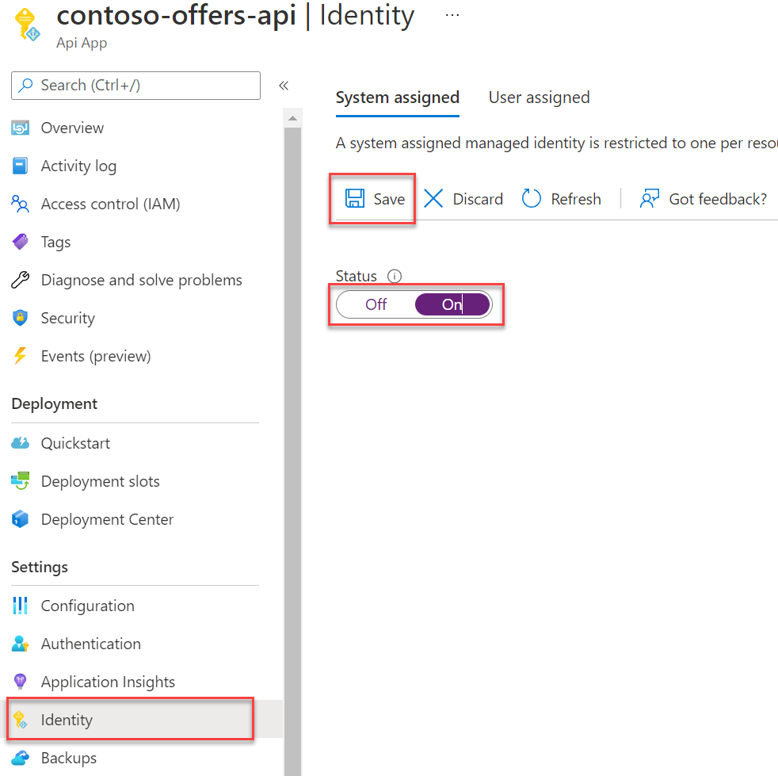
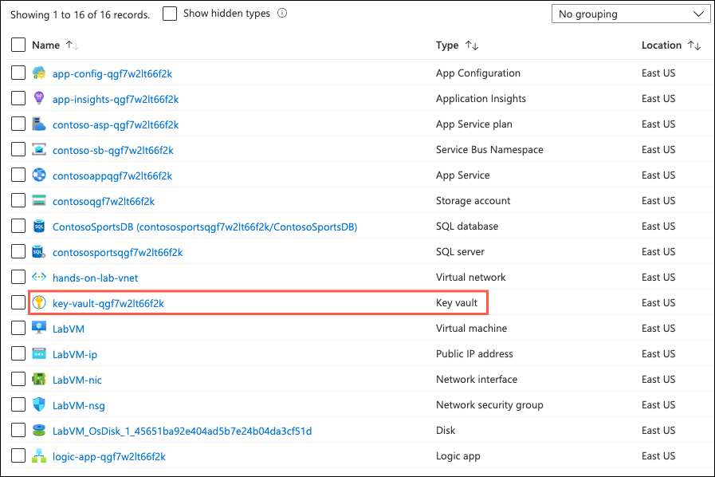
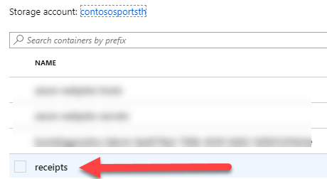
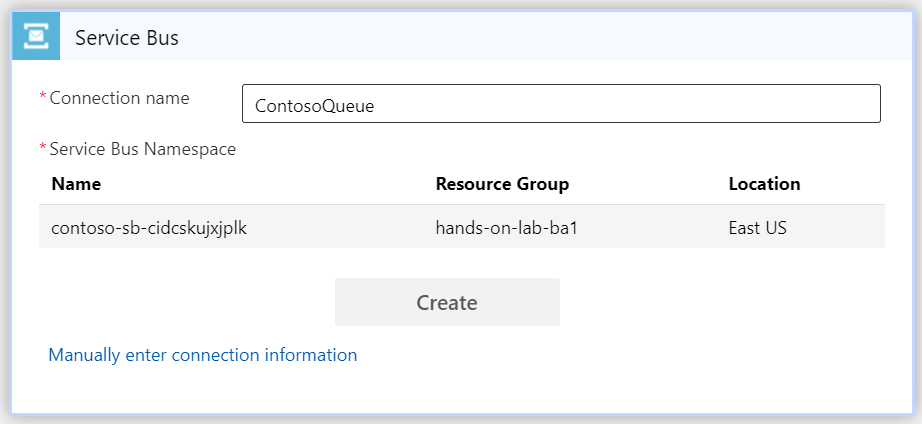
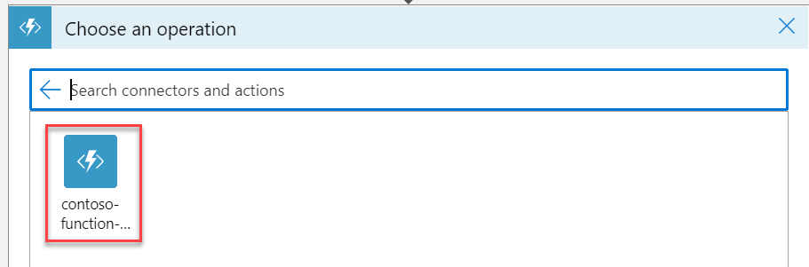

# Challenge 11: Automating backend processes with Azure Functions and Logic Apps

**Duration**: 45 Minutes

Contoso wants to automate the process of generating receipts in PDF format and alerting users when their orders have been processed using Azure Logic App and Functions. To run custom snippets of C\# or node.js in logic apps, you can create custom functions through Azure Functions. [Azure Functions](https://docs.microsoft.com/azure/azure-functions/functions-overview) offers server-free computing in Microsoft Azure and are useful for performing these tasks:

- Advanced formatting or compute of fields in logic apps
- Perform calculations in a workflow
- Extend the logic app functionality with functions that are supported in C\# or node.js

- [Challenge 11: Automating backend processes with Azure Functions and Logic Apps](#challenge-11-automating-backend-processes-with-azure-functions-and-logic-apps)
  - [Task 1: Create an Azure Function to Generate PDF Receipts](#task-1-create-an-azure-function-to-generate-pdf-receipts)
  - [Task 2: Add Key Vault access using a managed identity](#task-2-add-key-vault-access-using-a-managed-identity)
  - [Task 3: Configure and deploy the Function App](#task-3-configure-and-deploy-the-function-app)
  - [Task 4: Create an Azure Logic App to Process Orders](#task-4-create-an-azure-logic-app-to-process-orders)

## Task 1: Create an Azure Function to Generate PDF Receipts

1. In the [Azure portal](https://portal.azure.com), select **Resource groups** from the Azure services list.

   

2. Select the **hands-on-lab-SUFFIX** resource group from the list.

   

3. On the Resource group blade, select **Create** on the toolbar.

    

4. On the create a resource blade, enter "Function App" into the search box and select **Function App** in the search results and then select **Create**.

5. Provision and deploy the new function app, with the following settings:

    **Project Details**:

    - **Subscription**: Select the subscription you are using for this hands-on-lab.
    - **Resource Group**: Choose the **hands-on-lab-SUFFIX** resource group.

    **Instance Details**:

    - **Function App name**: Enter a globally unique name, such as `contoso-function-app-SUFFIX`.
    - **Publish**: Select **Code**.
    - **Runtime Stack**: Select **.NET**.
    - **Version**: Select **3.1**.
    - **Region**: Choose the same region used for the e-commerce web app in this lab.

    

6. Select **Next: Hosting >** and on the **Hosting** tab, set the following:

    **Storage**:

    - **Storage account**: Select the lab storage account, prefixed with **contoso**.

    **Operating System**:

    - **Operating System**: Select **Windows**.

    **Plan**:

    - **Plan type**: Select **App service plan**.
    - **Windows Plan**: Select **contoso-asp-{SUFFIX}**.
    - **Sku and size**: Select **Standard S1**.

    

7. Select **Review + create**, then **Create**. Wait for the deployment to complete.

8. Navigate to the **Function App** that was just created and select **Configuration**.

    

9. Add a new **Application Setting** with the following values:

   - **Name**: Enter `AppConfigConnectionString`.
   - **Value**: Enter the Connection String for the App Configuration Store.
  
10. Select the **OK** button.

11. Select the **Save** button, select **Continue** when prompted to verify the save action.

## Task 2: Add Key Vault access using a managed identity

The function application resource needs access to the Key Vault. The App Configuration will use pass-through authentication to the Key Vault. To authenticate the application, it will utilize a system managed identity.

1. From the left-hand navigation menu, select **Identity**, and on the Identity blade, change the status to **On** and select **Save** on the toolbar. When prompted to verify the save action, select **Yes**.

    

2. Return to the **hands-on-lab-SUFFIX** resource group and select the **Key vault** resource from the list.

    

3. From the left menu, select **Access policies** and then select the **Add Access Policy** link.

    

4. In the **Add access policy** form:

    - **Secret permissions**: Expand the list and check the box next to **Get**.
    - **Select principal**: Select **None selected** and in the **Select principal** dialog, search for the name of the call center application you just created and choose the managed identity.

    

5. Select **Add** on the Add access policy dialog.

6. Select **Save** on the Access policies toolbar to commit the changes.

## Task 3: Configure and deploy the Function App

1. In Visual Studio, expand the **Web** folder and right-click on the **Contoso.Apps.FunctionApp** project and select **Manage NuGet Packages**.

2. On the **Browse** tab, search for and select **Microsoft.Extensions.Configuration.AzureAppConfiguration**. In the right pane, select **Install**.

3. Repeat step 2, this time for the package **Azure.Identity**.

4. Within the **Contoso.Apps.FunctionApp** project, locate and open the `ContosoMakePdf.cs` source file.

5. Uncomment the following **using** statements:

    ```csharp
    using Microsoft.Extensions.Configuration;
    using Azure.Identity;
    ```  

6. Inside the static class **ContosoMakePdf**, uncomment the following code that sets up a connection to the App Configuration store and the Key Vault credential pass-through:

    ```csharp
    private static IConfiguration Configuration { set; get; }

    static ContosoMakePdf()
    {
        var builder = new ConfigurationBuilder();            
        builder.AddAzureAppConfiguration(options =>
        {
            options.Connect(Environment.GetEnvironmentVariable("AppConfigConnectionString"))               
                    .ConfigureKeyVault(kv =>
                    {
                        kv.SetCredential(new DefaultAzureCredential());
                    });
        });
        Configuration = builder.Build();
    }
    ```

7. In the **ProcessOrder** method, uncomment the following line of code:

    ```csharp
    Order.ReceiptUrl = await StorageMethods.UploadPdfToBlob(receipt, fileName, Configuration, log);
    ```

8. Save all files.

9. To publish the Function App, open the Visual Studio solution, Right-click on the **Contoso.Apps.FunctionApp** project, then select **Publish**.

10. For **Target**, choose **Azure** and then select **Next**.

11. For **Specific target**, choose **Azure Function App (Windows)**, then select **Next**.

12. For **Functions instance**, expand the lab resource group and select the **Function App**, then select **Finish**.

    

13. Select **Publish**.

    > **Note**: The publish should only take a minute or so. You can check the **Output** window for any errors that may occur.

    

14. To test your newly published Function App, start by navigating back to your Contoso Function App in the Azure Portal. From the left menu, select **Functions** then select the newly created **ContosoMakePDF** function. You may need to use the **Refresh** button on the toolbar for the function to be listed.

    

15. Select the **Code + Test** link, then select the **Test/Run** button.

    

16. Select **POST** for the HTTP method.

17. Open the **sample.dat** file found in the `C:\MCW\MCW-Modern-cloud-apps-main\Hands-on lab\lab-files\src\Contoso Sports League\Contoso.CreatePDFReport` directory on your LabVM. Copy the contents into the **Request body** text box.

    

18. Select the **Run** button located at the bottom of the blade.

    

    > **Note**: There is also a **Run** button located at the top of the Azure Function blade. Selecting either of these buttons will run the function just the same.

    After a few seconds, you should see logs like in the below image. You should see return status code of 200.  The **Output** text box should show recent Contoso purchase data. You should see a message stating the file has been created and stored in the blob storage.

    

19. Check your receipt PDF in the storage account blob.

    - Navigate to the ContosoSports storage account.
    - Select the **Blobs** link.

    

20. Choose the newly created **receipts** blob container.

    

21. Open **ContosoSportsLeague-Store-Receipt-XX.pdf** link.

    

22. Open the `...` link and choose **Download**.

    

## Task 4: Create an Azure Logic App to Process Orders

Without writing any code, you can automate business processes more easily and quickly when you create and run workflows with Azure Logic Apps. Logic Apps provide a way to simplify and implement scalable integrations and workflows in the cloud. It provides a visual designer to model and automate your process as a series of steps known as a workflow. There are [many connectors](https://docs.microsoft.com/azure/connectors/apis-list) across the cloud and on-premises to quickly integrate across services and protocols.

The advantages of using Logic Apps include the following:

- Saving time by designing complex processes using easy to understand design tools
- Implementing patterns and workflows seamlessly, that would otherwise be difficult to implement in code
- Getting started quickly from templates
- Customizing your logic app with your own custom APIs, code, and actions
- Connect and synchronize disparate systems across on-premises and the cloud
- Build off BizTalk server, API Management, Azure Functions, and Azure Service Bus with first-class integration support

1. Open the lab resource group and select the **logic-app-{{SUFFIX}}** Logic app resource.

2. This will bring up a **Logic Apps Designer** screen. Beneath the **Start with a common trigger** heading, choose **When a message is received in a Service Bus queue** item.

    

3. On the design surface, select the **Create** link next to the **Service Bus** item.

    

4. Specify **ContosoQueue** as the connection name, select the Contoso Service Bus item **contoso-sb-{{SUFFIX}}** from the list of Service Bus Namespaces.

    

5. Select the **RootManageSharedAccessKey** from the list of Service Bus Policies, then select **Create**.

    

6. Select **Continue** beneath the Service Bus item.

7. In the **When a message is received in a queue (autocomplete)** item, select the **receiptgenerator** queue from the drop-down.

    

    >**Note**: If you wish, you can set the **Interval** and **Frequency** to check for new items to a shorter interval than the default; such as every 30 seconds. This could help reduce delay for when the Logic App is triggered when new messages are sent to the Service Bus Queue while you progress through this lab.

8. Select the **+ New step** button, choose the **All** tab, then search for and select **Azure Functions**. In the **Actions** section, select the **Choose an Azure Function** item.

    

9. Select the Function App that you created earlier in this lab.

    

10. Beneath the Actions, select the Azure function **ContosoMakePDF**.

    

11. Type this in the Request Body:

    ```json
    {"Order": pick Content from list (see picture below) }
    ```

    Make sure the syntax is json format. Sometimes the ":" will go to the right side of Content by mistake. Keep it on the left. It should look like this:

    

12. Select **Save** to save the Logic App.

13. Run the logic app by expanding the **Run trigger** button of the Logic app designer toolbar and selecting **Run**. It should process the orders you have submitted previously to test PDF generation. Using Azure Storage Explorer or Visual Studio Cloud Explorer you can navigate to the storage account and open the receipts container to see the created PDFs.

    

    

14. Double-click the PDF document to download and see the Purchase receipt.

15. Open the **ContosoLogicApplication** Logic Apps Designer. We will be adding another to the flow for updating the database. In the designer, select **+ New step**.

    

16. In the **Choose an operation** item, Select the **All** tab, then search for and select **SQL Server**. In the **Actions** section, select **Update row (V2)**.

    

17. Enter the following values, then select **Create**:

    - Connection name: **ContosoSportsDB**

    - Authentication Type: **SQL Server Authentication**

    - SQL server name: _Enter the DNS name of the SQL Database Failover Cluster Read/Write Listener Endpoint that was copied previously_.

    - SQL database name: `ContosoSportsDB`

    - Username: `demouser`

    - Password: `Password.1!!`

    

18. Select the **Server name** and **Database name** previously specified, then from the drop-down select the name of the **Orders** table and enter `OrderId` into the **Row id** field.

    

19. Press **Save**, then select the **Code View** button.

20. Add the following JSON within the `Update_row_(V2).inputs` object:

    ```json
    "body": {
        "OrderDate": "@{body('ContosoMakePDF')['OrderDate']}",
        "FirstName": "@{body('ContosoMakePDF')['FirstName']}",
        "LastName": "@{body('ContosoMakePDF')['LastName']}",
        "Address": "@{body('ContosoMakePDF')['Address']}",
        "City": "@{body('ContosoMakePDF')['City']}",
        "State": "@{body('ContosoMakePDF')['State']}",
        "PostalCode": "@{body('ContosoMakePDF')['PostalCode']}",
        "Country": "@{body('ContosoMakePDF')['Country']}",
        "Phone": "@{body('ContosoMakePDF')['Phone']}",
        "SMSOptIn": "@{body('ContosoMakePDF')['SMSOptIn']}",
        "SMSStatus": "@{body('ContosoMakePDF')['SMSStatus']}",
        "Email": "@{body('ContosoMakePDF')['Email']}",
        "ReceiptUrl": "@{body('ContosoMakePDF')['ReceiptUrl']}",
        "Total": "@{body('ContosoMakePDF')['Total']}",
        "PaymentTransactionId": "@{body('ContosoMakePDF')['PaymentTransactionId']}",
        "HasBeenShipped": "@{body('ContosoMakePDF')['HasBeenShipped']}"
    },
    ```

    After this has been added, the JSON will look as follows:

    

21. And modify the `path` variable for the `Update_row_(V2)` action to include the index key or OrderId as follows:

    ```json
    "path": "/v2/datasets/@{encodeURIComponent(encodeURIComponent('default'))},@{encodeURIComponent(encodeURIComponent('default'))}/tables/@{encodeURIComponent(encodeURIComponent('[dbo].[Orders]'))}/items/@{encodeURIComponent(encodeURIComponent(body('ContosoMakePDF')['OrderId']))}"
    ```

22. **Save** and return to the designer.

23. Your updated designer view should look like this:

    

24. Select Run on the Logic App Designer, and then run the Contoso sports Web App and check out an Item.

25. Run the call center website app and select the last Details link in the list.

    

26. You should now see a Download receipt link because the database has been updated.

    

27. Select the Download receipt link to see the receipt.

28. Return to the Logic app and you should see all green check marks for each step. If not, select the yellow status icon to find out details.

    
