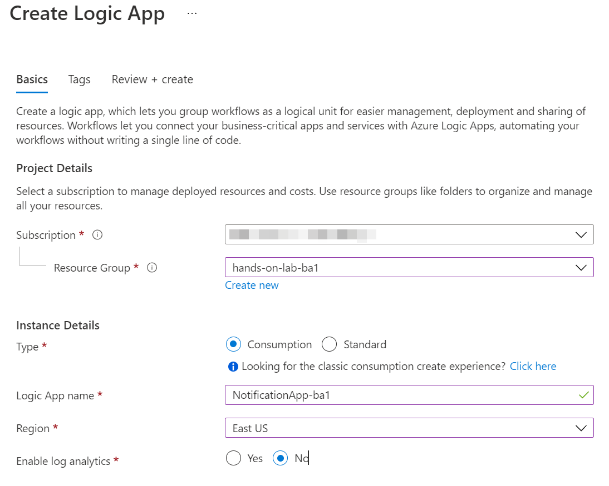
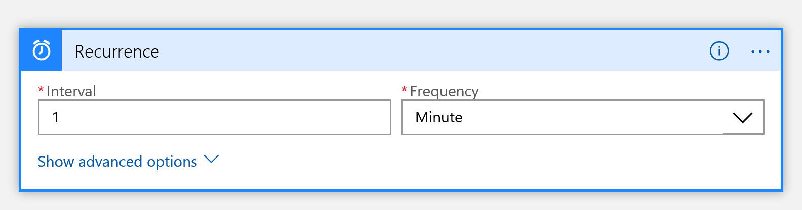
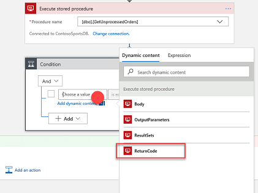
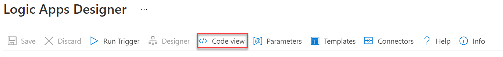

# Challenge 12: Use Twilio to send SMS Order Notifications

**Duration**: 45 Minutes

In this challenge, you use Logic Apps and Twilio to send SMS order notifications.

- [Challenge 12: Use Twilio to send SMS Order Notifications](#challenge-12-use-twilio-to-send-sms-order-notifications)
  - [Task 1: Configure your Twilio trial account](#task-1-configure-your-twilio-trial-account)
  - [Task 2: Create a new logic app](#task-2-create-a-new-logic-app)

## Task 1: Configure your Twilio trial account

1. If you do not have a Twilio account, sign up for one for free at the following URL:

    [https://www.twilio.com/try-twilio](https://www.twilio.com/try-twilio)

   

2. On the home dashboard, select **Get a Trial Number**.

   

3. Record the **Phone Number**, select the **Choose this Number** button on the **Your first Twilio Phone Number** prompt, and select **Done**.

    

4. Remaining on the dashboard, in the **Project Info** section, record the **Account SID** and **Auth Token** for use when configuring the Twilio Connector.

    

## Task 2: Create a new logic app

1. Open **Azure Data Studio** on the LabVM.

2. In Azure Data Studio, select **New connection** and in the connection dialog enter the details to connect to the SQL Database for the **ContosoSportsDB** database, as follows:

    - **Connection Type**: Select Microsoft SQL Server.
    - **Server**: Enter the failover read/write listener endpoint.
    - **Authentication type**: Select **SQL Login**.
    - **User name**: Enter `demouser`.
    - **Password**: Enter `Password.1!!`.
    - **Remember password**: Check this box.
    - **Database**: Select **ContosoSportsDB**.

    

3. Select **Connect** to open the connection to the database.

4. In the open connection window, select **New Query** on the toolbar.

    

5. In the query window that opens, paste the following code:

    ```sql
    CREATE PROCEDURE [dbo].[GetUnprocessedOrders]
    AS
    declare @returnCode int 
    SELECT @returnCode = COUNT(*) FROM [dbo].[Orders] WHERE PaymentTransactionId is not null AND PaymentTransactionId <> '' AND Phone is not null AND Phone <> '' AND SMSOptIn = '1' AND SMSStatus is null
    return @returnCode

    GO
    ```

6. Select **Run** in the toolbar to execute the query.

    

7. You should receive a message in the output panel that the commands completed successfully.

    

8. Delete the SQL script for the Stored Procedure from the query editor, and replace it with the following:

    ```sql
    CREATE PROCEDURE [dbo].[ProcessOrders]
    AS
    SELECT * FROM [dbo].[Orders] WHERE PaymentTransactionId is not null AND PaymentTransactionId <> '' AND Phone is not null AND Phone <> '' AND SMSOptIn = '1' AND SMSStatus is null;

    UPDATE [dbo].[Orders] SET SMSStatus = 'sent' WHERE PaymentTransactionId is not null AND PaymentTransactionId <> '' AND Phone is not null AND Phone <> '' AND SMSOptIn = '1' AND SMSStatus is null;
    ```

9. Select **Run** in the toolbar to execute the query.

10. Return to the **hands-on-lab-SUFFIX** resource group and select **Create**.

11. Search for and select the **Logic App** item. Select **Create**.

12. Name the logic app **NotificationApp{{SUFFIX}}**, **Consumption** instance type, and select the lab Azure Region. The remaining fields retain their default values. Select **Review + create**, then **Create**.

    

13. Once deployment has completed, return to the **hands-on-lab-SUFFIX** resource group, and select the **NotificationApp{{SUFFIX}}** Logic app resource from the list of resources.

14. In the Logic Apps Designer, select the **Blank Logic App** Template.

    

15. On the **Logic Apps Designer**, select the **All** tab, and choose **Schedule**. Then, select **Recurrence**.

    

16. Set the **FREQUENCY** to **MINUTE**, and **INTERVAL** to 1.

    

17. Select the **+ New Step** button.

18. Type **SQL Server** into the filter box and select the **SQL Server -- Execute stored procedure (V2)** action.

    

19. In the **Execute stored procedure (V2)** box, we'll be reusing the established connection to the failover Read/write listener endpoint of our ContosoSportsDB:

    - **Server name**: Select **Use connection settings**
    - **Database name**: Select **Use connection settings**
    - **Procedure name**: Select `[dbo].[GetUnprocessedOrders]`.

    ![In the Execute stored procedure section, the Procedure name is \[dbo\].\[GetUnprocessedOrders\].](media/logic-app-execute-stored-procedure-unprocessed-orders.png "Execute stored procedure section")

20. Select **+ New step** and search for and select the **Control** object.

    

21. Under **Actions**, select the **Condition** object.

      

22. Select **Choose a value**, and then select **Return Code** from the Dynamic content tile.

    

23. Specify **ReturnCode**, set the RELATIONSHIP to **is greater than**, and set the VALUE to **0**.

    

24. Select the **Add an action** link on the **If true** condition.

    

25. Select **SQL Server**, and then select the **SQL Server -- Execute stored procedure (V2)** action.

    

26. Select the **ProcessOrders** stored procedure in the Procedure name dropdown.

    ![Under If Yes, Execute stored procedure 2 is selected, and the Procedure name is \[dbo\].\[ProcessOrders\].](media/2020-03-19-11-40-49.png "If yes section")

27. Select the **Add an action** link.

    

28. Select **Control** and **For each**.

29. In the **Select an output from previous steps**, select **ResultSets Table1**.

    

30. Select **Add an action** within the **For each** block, and search for **Twilio** in the filter box, and select the **Twilio -- Send Text Message (SMS)** item in the Actions box.

    

31. Set the Connection Name to Twilio, specify your Twilio **Account SID** and **Authentication Token**, then select the **Create** button.

    ")

32. Using the drop-down, select your Twilio number for the **FROM PHONE NUMBER** field.

33. In the **To phone number** field, select **ResultSets Phone**.

34. In the **Text** field, enter `Hello` followed by the dynamic value for **ResultSets FirstName**, then followed by `, your order has shipped!`.

    ")

35. On the Logic App toolbar, select the **Code View** button to review the JSON code generated by the UI.

    

36. Select **Save** on the toolbar to enable the logic app.

    

37. The completed JSON code should look similar to the following:

    ```json
    {
        "definition": {
            "$schema": "https://schema.management.azure.com/providers/Microsoft.Logic/schemas/2016-06-01/workflowdefinition.json#",
            "actions": {
                "Condition": {
                    "actions": {
                        "Execute_stored_procedure_(V2)_2": {
                            "inputs": {
                                "body": {},
                                "host": {
                                    "connection": {
                                        "name": "@parameters('$connections')['sql']['connectionId']"
                                    }
                                },
                                "method": "post",
                                "path": "/v2/datasets/@{encodeURIComponent(encodeURIComponent('default'))},@{encodeURIComponent(encodeURIComponent('default'))}/procedures/@{encodeURIComponent(encodeURIComponent('[dbo].[ProcessOrders]'))}"
                            },
                            "runAfter": {},
                            "type": "ApiConnection"
                        },
                        "For_each": {
                            "actions": {
                                "Send_Text_Message_(SMS)": {
                                    "inputs": {
                                        "body": {
                                            "body": "Hello @{items('For_each')?['FirstName']}, your order has shipped.",
                                            "from": "+15708869103",
                                            "to": "@items('For_each')?['Phone']"
                                        },
                                        "host": {
                                            "connection": {
                                                "name": "@parameters('$connections')['twilio']['connectionId']"
                                            }
                                        },
                                        "method": "post",
                                        "path": "/Messages.json"
                                    },
                                    "runAfter": {},
                                    "type": "ApiConnection"
                                }
                            },
                            "foreach": "@body('Execute_stored_procedure_(V2)_2')?['resultsets']?['Table1']",
                            "runAfter": {
                                "Execute_stored_procedure_(V2)_2": [
                                    "Succeeded"
                                ]
                            },
                            "type": "Foreach"
                        }
                    },
                    "expression": {
                        "and": [
                            {
                                "greater": [
                                    "@body('Execute_stored_procedure_(V2)')?['returncode']",
                                    0
                                ]
                            }
                        ]
                    },
                    "runAfter": {
                        "Execute_stored_procedure_(V2)": [
                            "Succeeded"
                        ]
                    },
                    "type": "If"
                },
                "Execute_stored_procedure_(V2)": {
                    "inputs": {
                        "body": {},
                        "host": {
                            "connection": {
                                "name": "@parameters('$connections')['sql']['connectionId']"
                            }
                        },
                        "method": "post",
                        "path": "/v2/datasets/@{encodeURIComponent(encodeURIComponent('default'))},@{encodeURIComponent(encodeURIComponent('default'))}/procedures/@{encodeURIComponent(encodeURIComponent('[dbo].[GetUnprocessedOrders]'))}"
                    },
                    "runAfter": {},
                    "type": "ApiConnection"
                }
            },
            "contentVersion": "1.0.0.0",
            "outputs": {},
            "parameters": {
                "$connections": {
                    "defaultValue": {},
                    "type": "Object"
                }
            },
            "triggers": {
                "Recurrence": {
                    "recurrence": {
                        "frequency": "Minute",
                        "interval": 1
                    },
                    "type": "recurrence"
                }
            }
        },
        "parameters": {
            "$connections": {
                "value": {
                    "sql": {
                        "connectionId": "/subscriptions/e223f1b3-d19b-4cfa-98e9-bc9be62717bc/resourceGroups/hands-on-lab/providers/Microsoft.Web/connections/sql",
                        "connectionName": "sql",
                        "id": "/subscriptions/e223f1b3-d19b-4cfa-98e9-bc9be62717bc/providers/Microsoft.Web/locations/eastus/managedApis/sql"
                    },
                    "twilio": {
                        "connectionId": "/subscriptions/e223f1b3-d19b-4cfa-98e9-bc9be62717bc/resourceGroups/hands-on-lab/providers/Microsoft.Web/connections/twilio",
                        "connectionName": "twilio",
                        "id": "/subscriptions/e223f1b3-d19b-4cfa-98e9-bc9be62717bc/providers/Microsoft.Web/locations/eastus/managedApis/twilio"
                    }
                }
            }
        }
    }
    ```

38. Your workflow should look like the image below, and you should receive a text for each order you placed. If you did not use your own phone number, place another order, and enter a phone number for which you can receive text messages.

    

39. Expand the **Run Trigger** button on the Logic App Designer toolbar and select **Run** to start the workflow.
