# Challenge 32: Automate deployments using GitHub actions

**Duration**: 30 minutes

The Contoso Sports League would like to move their existing source control to GitHub. In addition to this, they wish to implement automatic deployments of their projects into production. The desired workflow is that features are developed in their own branch and once complete, pull requests are issued to the main branch. The pull requests are then reviewed for quality assurance, and once approved, the pull request is then merged into the main branch of the repository. Upon this merge, the projects in the solution should be automatically released into the production Azure environment using the code from the main branch. In this challenge, you will learn how to deploy code to Azure from GitHub Actions in two different ways: via a Service Principal created in Active Directory, as well as via Application Service Publish Profiles.

In this challenge, you will release the Call Center Admin Portal application using this a service principal. This service principal is created in Azure Active Directory, and is granted the Contributor role to the deployed lab resources, scoped by the resource group.

- [Challenge 32: Automate deployments using GitHub actions](#challenge-32-automate-deployments-using-github-actions)
  - [Task 1: Create a GitHub repository](#task-1-create-a-github-repository)
  - [Task 2: Commit the existing lab files to source control](#task-2-commit-the-existing-lab-files-to-source-control)
  - [Task 3: Create a service principal in Active Directory](#task-3-create-a-service-principal-in-active-directory)
  - [Task 4: Create repository secrets](#task-4-create-repository-secrets)
  - [Task 5: Define the production deployment workflow](#task-5-define-the-production-deployment-workflow)
  - [Task 6: Trigger the Production Deployment Workflow](#task-6-trigger-the-production-deployment-workflow)

## Task 1: Create a GitHub repository

1. Open a web browser and navigate to <https://www.github.com>. Log in using your GitHub account credentials.

2. In the upper-right corner, expand the user drop down menu and select **Your repositories**.

    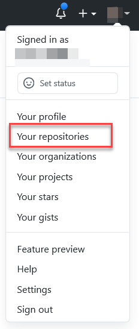

3. Next to the search criteria, locate and select the **New** button.

    

4. On the **Create a new repository** screen, name the repository **ContosoSports** and select the **Create repository** button.

    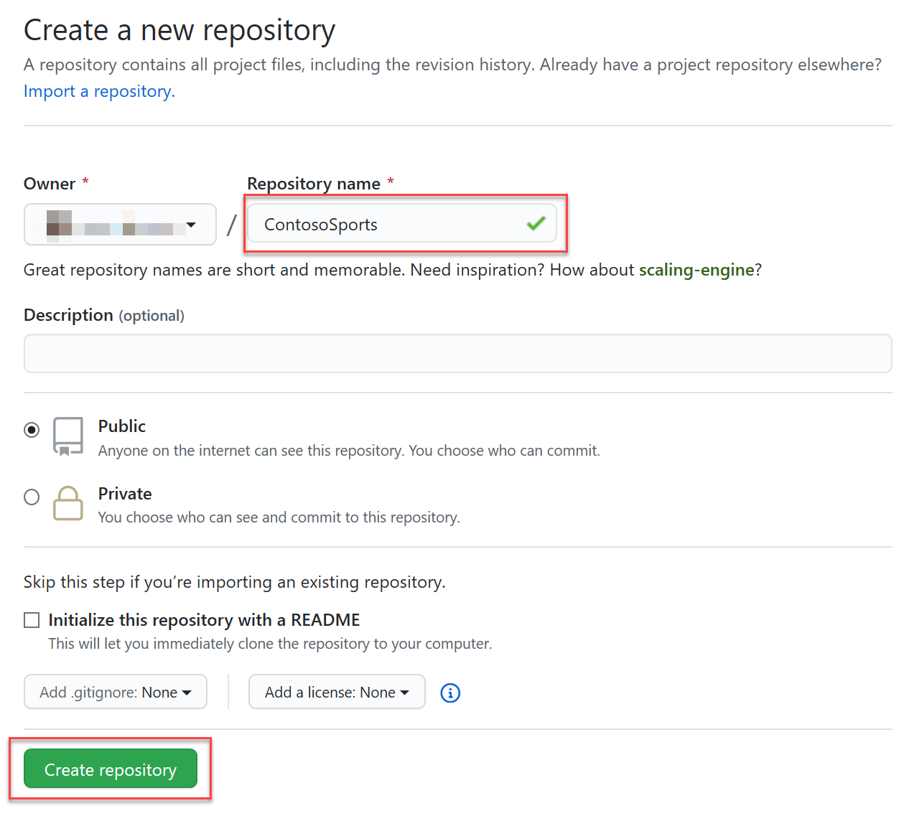

5. On the **Quick setup** screen, copy the **HTTPS** GitHub URL for your new repository, paste this in notepad for future use.

    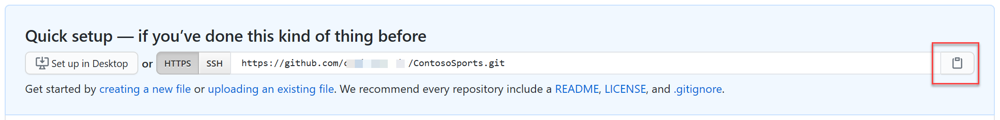

## Task 2: Commit the existing lab files to source control

1. Open a command prompt and change directory to the folder that contains the lab files solution file (Contoso.Apps.SportsLeague.sln), `C:\MCW\MCW-Modern-cloud-apps-main\Hands-on lab\lab-files\src\Contoso Sports League`.

2. At the command prompt, issue the following command to initialize the git repository:

    ```shell
    git init
    ```

3. Set the remote origin to the GitHub Url from the previous task by executing the following command (replace the URL with your own):

   ```shell
   git remote add origin <your GitHub Url>
   ```

4. Commit the initial code, and push it to the main branch by issuing the following commands:

    ```shell
    git config --global user.email "<ENTER YOUR GITHUB EMAIL HERE>"
    git add -A
    git commit -m "initial commit"
    git branch -m main
    git push -u origin main
    ```

## Task 3: Create a service principal in Active Directory

One method to deploy code using GitHub actions is to create a Service Principal that has the necessary access to deploy the web applications in the solution. In this challenge, we will be releasing the Call Center Admin Portal application using this service principal. This service principal is created in Azure Active Directory, and is granted the Contributor role to the deployed lab resources, scoped by the resource group.

1. In the Azure portal, select the icon to open the Cloud Shell located on the top toolbar.

    

    > **Note**: You may be prompted to create a storage account to support cloud shell activities, this is required in order to utilize the cloud shell.

2. Obtain the Subscription ID and Resource Group name by opening the resource group where you have deployed all the applications in this lab. The Subscription ID is available in the Overview pane.

3. In the Cloud Shell, execute the following to create the service principal scoped by the resource group we've been using in this lab (replace Subscription ID and resource group name):

    ```PowerShell
    az ad sp create-for-rbac --name 'mcw-modern-cloud-apps' --role contributor --scopes /subscriptions/<Subscription ID>/resourceGroups/<Resource Group Name> --sdk-auth
    ```

4. This will output a JSON data result, copy and paste this result and save it for a future step in this lab.

    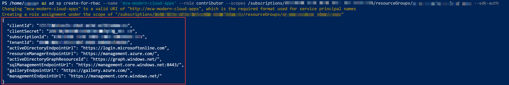

## Task 4: Create repository secrets

You have the ability to add secrets to the repository in GitHub. Secrets contain sensitive information that should never be checked into source control. These secrets are kept encrypted by GitHub and are made available to GitHub actions through the **secrets** collection (which you will see in the next task). We will be creating many secrets, as we have five projects that we are configuring for auto-deployment.

<!-- omit in toc -->
## Subtask 1: Create the service principal credentials secret

1. In GitHub, return to the **ContosoSports** repository screen and select the **Settings** tab.

2. From the left menu, select **Secrets**.

3. Select the **New secret** button.

   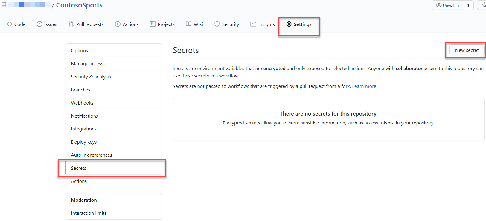

4. In the New secret form, enter the name **AZURE_CREDENTIALS**, and for the value, paste in the JSON data obtained when creating the Service Principal in the previous task. Select **Add secret**.

<!-- omit in toc -->
## Subtask 2: Create the e-commerce web application publish profile secret

1. In the Azure Portal, open the e-commerce web application service, it is the one named contosoapp{randomcharacters}.

2. From the top toolbar of the App Service screen, select **Get publish profile** item. This will download a file. Open this file in a text editor.

    

3. Return to the ContosoSports repository GitHub Secrets screen, and add a new secret named **AZURE_WEBAPP_PUBLISH_PROFILE**, for the value, paste the contents of the publish profile from the previous step, then select the **Add secret** button.

<!-- omit in toc -->
## Subtask 3: Create publish profile secrets for the remaining projects

Repeat Subtask 2 for the remaining projects by obtaining the publish profiles from the Azure Portal. Create the secrets as follows:

| Secret Name | Value |
|-------------|--------------------------|
| AZURE_API_PAYMENT_PUBLISH_PROFILE | Contents of the publish profile for the Payments API |
| AZURE_API_OFFERS_PUBLISH_PROFILE | Contents of the publish profile for the Offers API |
| AZURE_FUNCTIONAPP_PUBLISH_PROFILE | Contents of the publish profile for the Receipt Function Application |

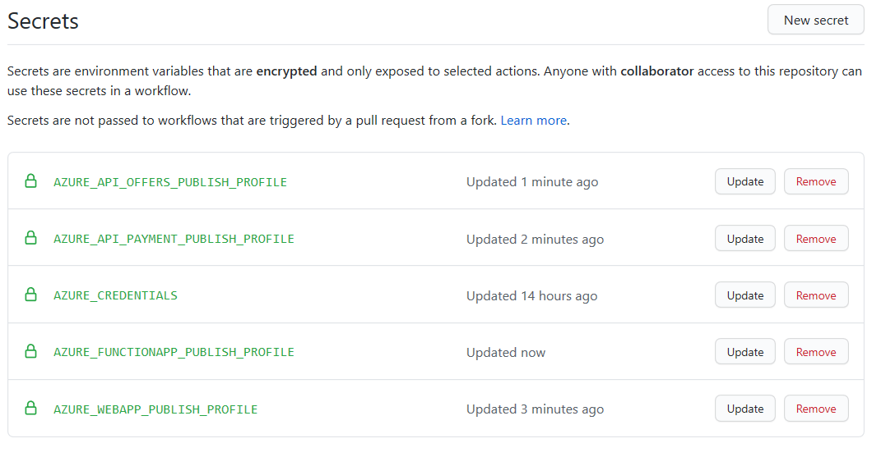

## Task 5: Define the production deployment workflow

1. In the web browser, return to the ContosoSports repository on GitHub, and select the **Actions** tab.

    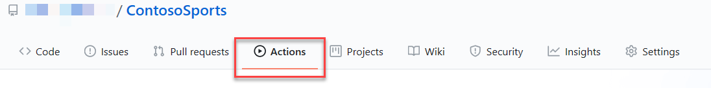

2. Beneath the **Get started with GitHub Actions** heading, select the **set up a workflow yourself** link.

3. Above the editor, name the workflow **productiondeployment.yml**. Remove all code in the file editor.

    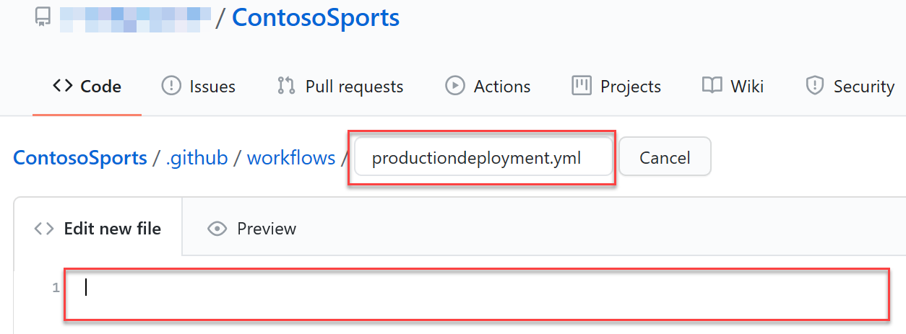

4. Copy and paste the following workflow to the text editor. The code is documented inline.

    ```yml
    name: Contoso Sports Production Deployment

    # This workflow is triggered on push to the main branch of the repository
    on:
    push:
        branches:
        - main

    # Environment variables are defined so that they can be used throughout the job definitions.
    # Be sure to replace the tokens in the AZURE_*_NAME variables with the names of the resources in Azure
    env:  
    AZURE_WEBAPP_NAME: '<E-Commerce Web Application Name - named similar to contosoapp{random characters}>'
    AZURE_WEBAPP_PROJECT_NAME: 'Contoso.Apps.SportsLeague.Web'  
    AZURE_WEBAPP_PUBLISH_PROFILE: ${{ secrets.AZURE_WEBAPP_PUBLISH_PROFILE }}

    AZURE_ADMINAPP_NAME: '<The name of the Call Center admin App Service in Azure>'
    AZURE_ADMINAPP_PROJECT_NAME: 'Contoso.Apps.SportsLeague.Admin'

    AZURE_API_PAYMENT_NAME: '<The name of the Payments API App Service in Azure>'
    AZURE_API_PAYMENT_PROJECT_NAME: 'Contoso.Apps.PaymentGateway'
    AZURE_API_PAYMENT_PUBLISH_PROFILE: ${{ secrets.AZURE_API_PAYMENT_PUBLISH_PROFILE }}

    AZURE_API_OFFERS_NAME: '<The name of the Offers API App Service in Azure>'
    AZURE_API_OFFERS_PROJECT_NAME: 'Contoso.Apps.SportsLeague.Offers'
    AZURE_API_OFFERS_PUBLISH_PROFILE: ${{ secrets.AZURE_API_OFFERS_PUBLISH_PROFILE }}

    AZURE_FUNCTIONAPP_NAME: '<The name of the Function App in Azure>'
    AZURE_FUNCTIONAPP_PROJECT_NAME: 'Contoso.Apps.FunctionApp'
    AZURE_FUNCTIONAPP_PUBLISH_PROFILE: ${{ secrets.AZURE_FUNCTIONAPP_PUBLISH_PROFILE }}

    DOTNET_VERSION: '3.1.102'

    # Jobs define the actions that take place when code is pushed to the main branch
    jobs:

    # Build and deploy the E-Commerce Web Application using the Publish Profile
    build-and-deploy-webapp:
        runs-on: ubuntu-latest
        steps:
        # Checkout the repo
        - uses: actions/checkout@main

        # Setup .NET Core SDK
        - name: Setup .NET Core
            uses: actions/setup-dotnet@v1
            with:
            dotnet-version: ${{ env.DOTNET_VERSION }}

        # Run dotnet build and publish on the project
        - name: dotnet build web portal and publish
            run: |
            dotnet build ${{ env.AZURE_WEBAPP_PROJECT_NAME }} --configuration Release
            dotnet publish ${{ env.AZURE_WEBAPP_PROJECT_NAME }} -c Release -o './webdeploy'

        # Deploy to Azure Application Service
        - name: 'Deploy public web portal'
            uses: azure/webapps-deploy@v2
            with:
            app-name: ${{ env.AZURE_WEBAPP_NAME }}
            publish-profile: ${{ secrets.AZURE_WEBAPP_PUBLISH_PROFILE }}
            package: './webdeploy'

    # Build and deploy the Call Center admin using the Service Principal credentials
    build-and-deploy-admin:
        runs-on: ubuntu-latest
        steps:
        # Checkout the repo
        - uses: actions/checkout@main

        # Setup .NET Core SDK
        - name: Setup .NET Core
            uses: actions/setup-dotnet@v1
            with:
            dotnet-version: ${{ env.DOTNET_VERSION }}

        # Run dotnet build and publish
        - name: dotnet build web portal and publish on the project
            run: |
            dotnet build ${{ env.AZURE_ADMINAPP_PROJECT_NAME }} --configuration Release
            dotnet publish ${{ env.AZURE_ADMINAPP_PROJECT_NAME }} -c Release -o './admindeploy'

        # Login to Azure
        - name: Login via Az module
            uses: azure/login@v1.1
            with:
            creds: ${{ secrets.AZURE_CREDENTIALS }}

        # Deploy to Azure Application Service
        - name: 'Deploy admin web portal'
            uses: azure/webapps-deploy@v2
            with:
            app-name: ${{ env.AZURE_ADMINAPP_NAME }}
            credentials: ${{ secrets.AZURE_CREDENTIALS }}
            package: './admindeploy'

        #Azure logout
        - name: logout
            run: |
            az logout

    # Build and deploy the Payments API using the Publish Profile
    build-and-deploy-payment-api:
        runs-on: ubuntu-latest
        steps:
        # Checkout the repo
        - uses: actions/checkout@main

        # Setup .NET Core SDK
        - name: Setup .NET Core
            uses: actions/setup-dotnet@v1
            with:
            dotnet-version: ${{ env.DOTNET_VERSION }}

        # Run dotnet build and publish on the project
        - name: dotnet build web portal and publish
            run: |
            dotnet build ${{ env.AZURE_API_PAYMENT_PROJECT_NAME }} --configuration Release
            dotnet publish ${{ env.AZURE_API_PAYMENT_PROJECT_NAME }} -c Release -o './paymentapideploy'

        # Deploy to Azure App Service 
        - name: 'Deploy payments API'
            uses: azure/webapps-deploy@v2
            with:
            app-name: ${{ env.AZURE_API_PAYMENT_NAME }}
            publish-profile: ${{ env.AZURE_API_PAYMENT_PUBLISH_PROFILE }}
            package: './paymentapideploy'

    # Build and deploy the Offer API using the Publish Profile
    build-and-deploy-offer-api:
        runs-on: ubuntu-latest
        steps:
        # Checkout the repo
        - uses: actions/checkout@main

        # Setup .NET Core SDK
        - name: Setup .NET Core
            uses: actions/setup-dotnet@v1
            with:
            dotnet-version: ${{ env.DOTNET_VERSION }}

        # Run dotnet build and publish on the project
        - name: dotnet build web portal and publish
            run: |
            dotnet build ${{ env.AZURE_API_OFFERS_PROJECT_NAME }} --configuration Release
            dotnet publish ${{ env.AZURE_API_OFFERS_PROJECT_NAME }} -c Release -o './offerapideploy'

        # Deploy to Azure App Service
        - name: 'Deploy offers API'
            uses: azure/webapps-deploy@v2
            with:
            app-name: ${{ env.AZURE_API_OFFERS_NAME }}
            publish-profile: ${{ env.AZURE_API_OFFERS_PUBLISH_PROFILE }}
            package: './offerapideploy'

    # Build and deploy the PDF receipt generation function app using the publish profile
    build-and-deploy-pdffunctionapp:
        runs-on: ubuntu-latest
        steps:
        # Checkout the repo
        - uses: actions/checkout@main

        # Setup .NET Core SDK
        - name: Setup .NET Core
            uses: actions/setup-dotnet@v1
            with:
            dotnet-version: ${{ env.DOTNET_VERSION }}

        # Run dotnet build and publish on the project
        - name: dotnet build web portal and publish
            run: |
            dotnet build ${{ env.AZURE_FUNCTIONAPP_PROJECT_NAME  }} --configuration Release
            dotnet publish ${{ env.AZURE_FUNCTIONAPP_PROJECT_NAME  }} -c Release -o './pdfappdeploy'

        - name: 'Deploy to Azure Function App service'
            uses: Azure/functions-action@v1
            with:
            app-name: ${{ env.AZURE_FUNCTIONAPP_NAME }}
            package: './pdfappdeploy'
            publish-profile: ${{ secrets.AZURE_FUNCTIONAPP_PUBLISH_PROFILE }}
    ```

    >**Note**: Due to the nature of some browsers, you may need to adjust the whitespace of the yml document after it has been pasted into GitHub.

5. Select the **Start commit** button to commit the workflow to the repository.

6. Enter a commit title and comment, and select **Commit new file**.

    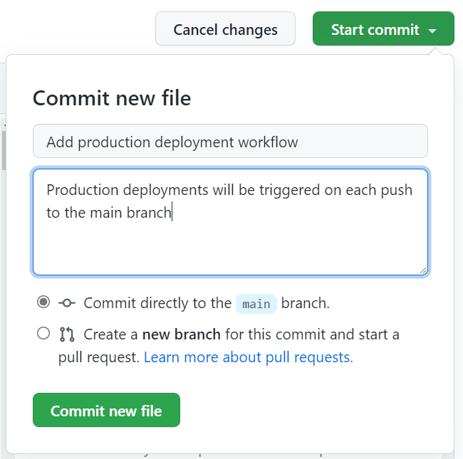

7. Committing this file is a push to the main branch. This means that the workflow that we just created is triggered. Select the **Actions** tab to view the currently running/historical record of workflow executions.

    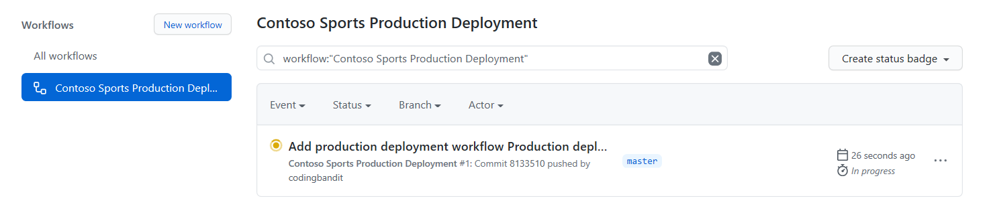

8. You are able to drill into each workflow, and each job executed by the workflow. Furthermore, as you drill into the job, you are able to see the output of each step contained in the job by expanding the section in the console runner window.

    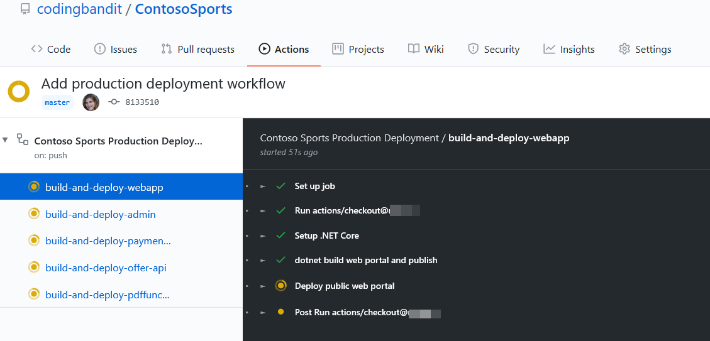

    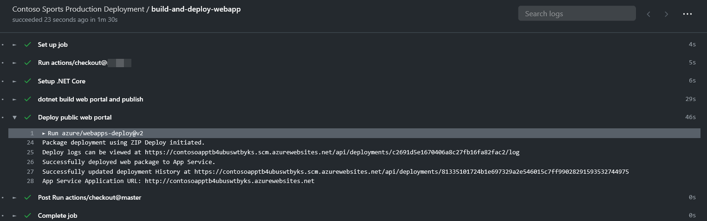

## Task 6: Trigger the Production Deployment Workflow

In this task, we will be making a modification to the e-commerce web application in a branch and issuing a pull request to the main branch. We will manually merge the pull request into the main branch to trigger the production deployment workflow.

1. Open a command prompt, and change directory to where the Visual Studio solution file is found.

2. Execute the following commands to create a branch for this modification. Keep this command window open.

    ```shell
    git pull
    git branch textchange
    git checkout textchange
    ```

3. In Visual Studio, expand the e-commerce website project (Web/Contoso.Apps.SportsLeague.Web), and edit and save the **Views/Home/Index.cshtml** file.

    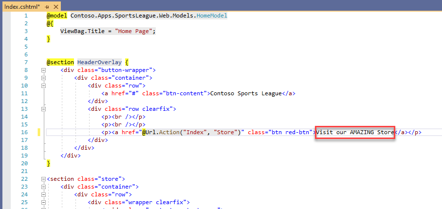

4. Return to the command window and execute the following commands to commit the text change to the branch:

    ```shell
    git commit -am "Changed some text"
    git push --set-upstream origin textchange
    ```

5. In a web browser, return to the ContosoSports source code repository.

6. Above the file listing table, you should see a notification that **textchange had recent pushes**. Select the **Compare &amp; pull request** button.

    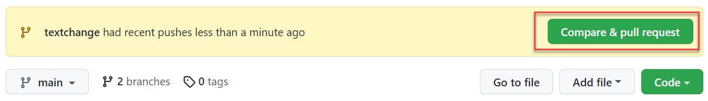

7. On the **Open a pull request** form, feel free to write a comment, and select the **Create pull request** button.

8. You should now see a message indicating that there are no conflicts with the base branch.

    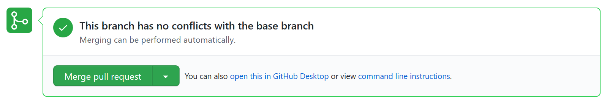

9. Select the **Actions** tab of the repository to verify that the deployment workflow has not been triggered by the recent file commits on the textchange branch.

10. Return to the pull request that was just created, by selecting the **Pull requests** tab, and selecting the pull request in the list.

11. Select the **Merge pull request** button on the pull request, then select **Confirm merge**.

12. Return to the **Actions** tab, and you should see that the workflow has been triggered (merging pushes new code to the branch, thus the production workflow is triggered).

    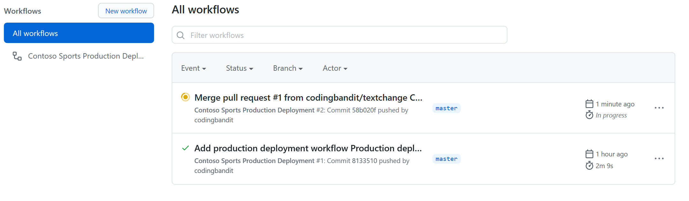

13. Once the deployment workflow has completed. Navigate to the E-commerce web application and ensure the changes you made are visible.

    
